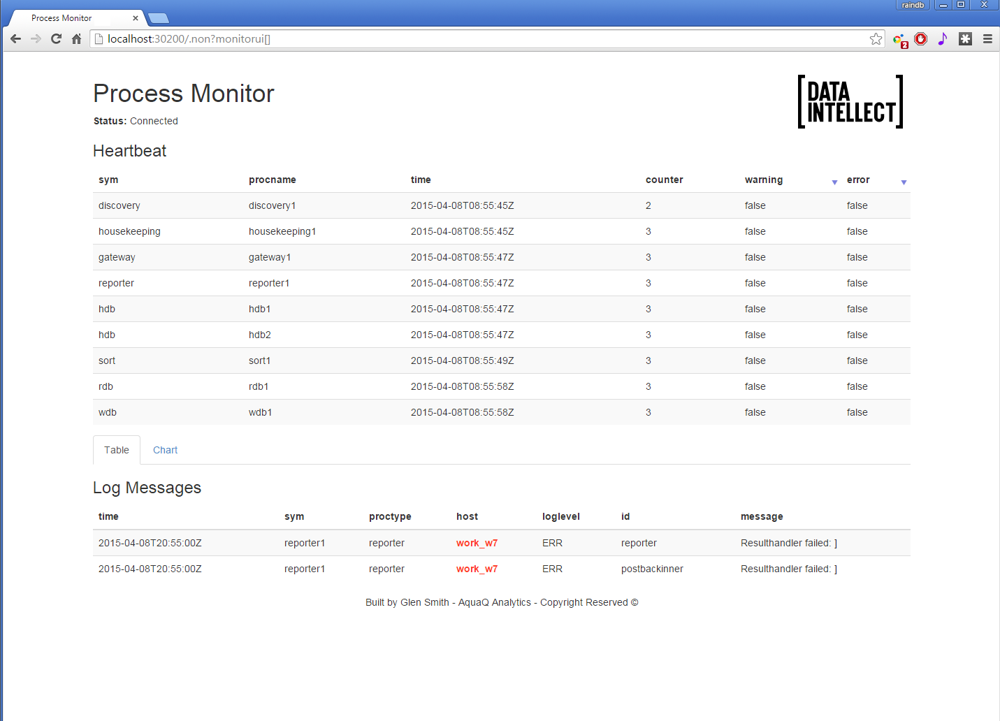

<a name="Processes"></a>

Processes
=========

A set of processes is included. These processes build upon AquaQ TorQ,
providing specific functionality. All the process scripts are contained
in $KDBCODE/processes. All processes should have an entry in
$KDBCONFIG/process.csv. All processes can have any type and name,
except for discovery services which must have a process type of
“discovery”. An example process.csv is:

    aquaq$ cat config/process.csv
    host,port,proctype,procname
    aquaq,9998,rdb,rdb_europe_1
    aquaq,9997,hdb,rdb_europe_1aquaq,9999,hdb,hdb1
    aquaq,9996,discovery,discovery1
    aquaq,9995,discovery,discovery2
    aquaq,8000,gateway,gateway1
    aquaq,5010,tickerplant,tickerplant1
    aquaq,5011,rdb,rdb1
    aquaq,5012,hdb,hdb1
    aquaq,5013,hdb,hdb2
    aquaq,9990,tickerlogreplay,tpreplay1
    aquaq,20000,kill,killhdbs
    aquaq,20001,monitor,monitor1
    aquaq,20002,housekeeping,hk1

<a name="disc"></a>

Discovery Service 
-----------------

### Overview

Processes use the discovery service to register their own availability,
find other processes (by process type) and subscribe to receive updates
for new process availability (by process type). The discovery service
does not manage connections- it simply returns tables of registered
processes, irrespective of their current availability. It is up to each
individual process to manage its own connections.

The discovery service uses the process.csv file to make connections to
processes on start up. After start up it is up to each individual
process to attempt connections and register with the discovery service.
This is done automatically, depending on the configuration parameters.
Multiple discovery services can be run in which case each process will
try to register and retrieve process details from each discovery process
it finds in its process.csv file. Discovery services do not replicate
between themselves. A discovery process must have its process type
listed as discovery.

To run the discovery service, use a start line such as:

    aquaq $ q torq.q -load code/processes/discovery.q -p 9995 -proctype discovery -procname discovery1

Modify the configuration as required.

### Operation

1.  Processes register with the discovery service.

    

2.  Processes use the discovery service to locate other processes.

     

3.  When new services register, any processes which have registered an
     interest in that process type are notified.

     

### Available Processes

The list of available processes can be found in the .servers.SERVERS
table.

    q).servers.SERVERS                                                                                                                                                                                                                                                            
    procname     proctype        hpup            w  hits startp                        lastp                         endp attributes                                                                   
    -------------------------------------------------------------------------------------
    discovery1   discovery       :aquaq:9995     0                                  2014.01.22D17:00:40.947470000      ()!()                                                                        
    discovery2   discovery       :aquaq:9996     0                                  2014.01.22D17:00:40.947517000      ()!()                                                                        
    hdb2         hdb             :aquaq:5013     0                                  2014.01.22D17:00:40.947602000      ()!()                                                                        
    killtick     kill            :aquaq:20000    0                                  2014.01.22D17:00:40.947602000      ()!()                                                                        
    tpreplay1    tickerlogreplay :aquaq:20002    0                                  2014.01.22D17:00:40.947602000      ()!()                                                                        
    tickerplant1 tickerplant     :aquaq:5010  6  0    2014.01.22D17:00:40.967699000 2014.01.22D17:00:40.967698000      ()!()                                                                        
    monitor1     monitor         :aquaq:20001 9  0    2014.01.22D17:00:40.971344000 2014.01.22D17:00:40.971344000      ()!()                                                                        
    rdb1         rdb             :aquaq:5011  7  0    2014.01.22D17:06:13.032883000 2014.01.22D17:06:13.032883000      `date`tables!(,2014.01.22;`fxquotes`heartbeat`logmsg`quotes`trades)          
    hdb3         hdb             :aquaq:5012  8  0    2014.01.22D17:06:18.647349000 2014.01.22D17:06:18.647349000      `date`tables!(2014.01.13 2014.01.14;`fxquotes`heartbeat`logmsg`quotes`trades)
    gateway1     gateway         :aquaq:5020  10 0    2014.01.22D17:06:32.152836000 2014.01.22D17:06:32.152836000      ()!()

<a name="gate"></a>

Gateway 
-------

A synchronous and asynchronous gateway is provided. The gateway can be
used for load balancing and/or to join the results of queries across
heterogeneous servers (e.g. an RDB and HDB). Ideally the gateway should
only be used with asynchronous calls. Prior to KDB v3.6, synchronous calls
caused the gateway to block which limits the gateway to serving one query at a 
time (although if querying across multiple backend servers the backend
queries will be run in parallel).
For v3.6+, deferred synchronous requests to the gateway are supported.
This allows the gateway to process multiple synchronous requests at once,
therefore removing the requirement for the gateway to allow only one type
of request.
When using asynchronous calls, the client can either block and wait for
the result (deferred synchronous) or post a call back function which the
gateway will call back to the client with. 
The backend servers to be queried against with  asynchronous and synchronous 
queries are selected using process type.
The gateway API can be seen by querying .api.p“.gw.\*” within a gateway
process.


### Asynchronous Behaviour

Asynchronous queries allow much greater flexibility. They allow multiple
queries to be serviced at once, prioritisation, and queries to be timed
out. When an asynchronous query is received the following happens:

-   the query is placed in a queue;

-   the list of available servers is retrieved;

-   the queue is prioritised, so those queries with higher priority are
      serviced first;

-   queries are sent to back end servers as they become available. Once
      the backend server returns its result, it is given another query;

-   when all the partial results from the query are returned the results
      are aggregated and returned to the client. They are either returned
      directly, or wrapped in a callback and posted back asynchronously to
      the client.

The two main customisable features of the gateway are the selection of
available servers (.gw.availableservers) and the queue prioritisation
(.gw.getnextqueryid). With default configuration, the available servers
are those servers which are not currently servicing a query from the
gateway, and the queue priority is a simple FIFO queue. The available
servers could be extended to handle process attributes, such as the
available datasets or the location of the process, and the queue
prioritisation could be modified to anything required e.g. based on the
query itself, the username, host of the client etc.

An asynchronous query can be timed out using a timeout defined by the
client. The gateway will periodically check if any client queries have
not completed in the alotted time, and return a timeout error to the
client. If the query is already running on any backend servers then they
cannot be timed out other than by using the standard -T flag.

### Synchronous Behaviour

Prior to KDB v3.6, when using synchronous queries the gateway could only handle one query at
a time and cannot timeout queries other than with the standard -T flag. The variable
`.gw.synccallsallowed` is by default set to 0b prior to KDB v3.6. 
To send synchronous calls, edit the gateway.q file so that .gw.synccallsallowed 
is set to true. (The exception being with TorQ-FSP, in which case it is set to 1b by default.)
For v3.6+, deferred synchronous calls are supported, allowing the gateway to process multiple
requests at a time.
All synchronous queries will be immediately dispatched to the back end
processes. They will be dispatched using an asynchronous call, allowing
them to run in parallel rather than serially. When the results are
received they are aggregated and returned to the client.

### Process Discovery

The gateway uses the discovery service to locate processes to query
across. The discovery service will notify the gateway when new processes
become available and the gateway will automatically connect and start
using them. The gateway can also use the static information in
process.csv, but this limits the gateway to a predefined list of
processes rather than allowing new services to come online as demand
requires.

### Error Handling

All errors and results can now be formatted with the formatresult function.
Each response to the client is passed through this function with inputs
status (1b=result,0b=error), sync (1b=sync,0b=async) and result (result/error)
to allow different errors/results to be handled appropriately.
As default, when synchronous calls are used, q errors are returned to clients as
they are encountered.
When using asynchronous calls, appropriately prefixed strings are used.
It is up to the client to check the type of the received result
and if it is a string then whether it contains the error prefix. The
error prefix can be changed, but the default is “error: ”.
Alternatively, the formatresult function can be altered as necessary.
Errors will be returned when:

-   the client requests a query against a server type which the gateway
    does not currently have any active instances of (this error is
    returned immediately);
    
-   the client requests a query with the wrong servertype types;

-   the client requests a query with null servers;

-   the query is timed out;

-   a back end server returns an error;

-   a back end server fails;

-   the join function fails.

If postback functions are used, the error string will be posted back
within the postback function (i.e. it will be packed the same way as a
valid result).

### Client Calls

There are four main client calls. The .gw.sync\* methods should only be
invoked synchronously, and the .gw.async\* methods should only be
invoked asynchronously. Each of these are documented more extensively in
the gateway api. Use .api.p“.gw.\*” for more details.

|                 Function                 |               Description                |
| :--------------------------------------: | :--------------------------------------: |
|    .gw.syncexec\[query; servertypes\]    | Execute the specified query synchronously against the required list of servers. If more than one server, the results will be razed. |
| .gw.syncexecj\[query; servertypes; joinfunction\] | Execute the specified query against the required list of servers. Use the specified join function to aggregate the results. |
|   .gw.asyncexec\[query; servertypes\]    | Execute the specified query against the required list of servers. If more than one server, the results will be razed. The client must block and wait for the results. |
| .gw.asyncexecjpt\[query; servertypes; joinfunction; postback; timeout\] | Execute the specified query against the required list of servers. Use the specified join function to aggregate the results. If the postback function is not set, the client must block and wait for the results. If it is set, the result will be wrapped in the specified postback function and returned asynchronously to the client. The query will be timed out if the timeout value is exceeded. |


### Client Call Examples

Here are some examples for using client calls via a handle to the gateway process.    
To reiterate, v3.6+ users can use synchronous calls, whilst asynchronous calls are only relevant for users on < v3.6. 

#### Calls to the RDB only
For synchronous calls
```
// To return the avg price per sym for the day so far
q) h(`.gw.syncexec;"select avp:avg price by sym from trade where time.date=.z.d";`rdb)

// hloc function in RDB process
q) h(`.gw.syncexec;`hloc;`rdb)
{[startdate;enddate;bucket]
 $[.z.d within (startdate;enddate);
 select high:max price, low:min price, open:first price,close:last price,totalsize:sum `long$size, vwap:size wavg price
 by sym, bucket xbar time
 from trade;
 ([sym:`symbol$();time:`timestamp$()] high:`float$();low:`float$();open:`float$();close:`float$();totalsize:`long$();vwap:`float$())]}


// Using the hloc function - change query for appropriate date
q) h(`.gw.syncexec;(`hloc;2020.01.08;2020.01.08;10);`rdb)

// Returns following table
sym  time                         | high   low    open   close  totalsize vwap
----------------------------------| ----------------------------------------------
AAPL 2020.01.08D00:00:00.836801000| 103.62 103.62 103.62 103.62 88        103.62
AAPL 2020.01.08D00:00:01.804684000| 103.64 103.64 103.64 103.64 86        103.64
AAPL 2020.01.08D00:00:02.405682000| 103.86 103.86 103.86 103.86 90        103.86
AAPL 2020.01.08D00:00:03.005465000| 104.06 104.06 104.06 104.06 78        104.06
AAPL 2020.01.08D00:00:03.404383000| 103.9  103.9  103.9  103.9  49        103.9
..
```
For asynchronous calls
```
// To return the sum size per sym for the day so far
q) neg[h](`.gw.asyncexec;"select sum size by sym from trade";`rdb);h[]
```

#### Calls to the HDB only
For synchronous calls
```
// For the high, low, open and close prices of the day before
q) h(`.gw.syncexec;"select h:max price, l:min price, o:first price, c:last price by sym from trade where date=.z.d-1";`hdb)
```
For asynchronous calls
```
q) neg[h](`.gw.asyncexec;"`$last .z.x";`hdb);h[]
```

#### Calls to the HDB and RDB
For synchronous calls
```
q) h(`.gw.syncexec;"$[.proc.proctype=`hdb; select from trade where date within (.z.d-2;.z.d-1); select from trade]";`rdb`hdb)
```
For asynchronous calls
```
q) neg[h](`.gw.asyncexec;"$[.proc.proctype=`hdb; select from trade where date within (.z.d-2;.z.d-1); select from trade]";`rdb`hdb);h[]
```

#### Demonstrating Aggregation of data
For the purposes of demonstration, assume that the following queries must be run
across a single RDB and a single HDB process, and the gateway has one RDB and two HDB
processes available to it.

    q).gw.servers                                                                                                                                                                                                                                                                 
    handle| servertype inuse active querycount lastquery                     usage                attributes                   
    ------| --------------------------------------------------------------------
    7     | rdb        0     1      17         2014.01.07D17:05:03.113927000 0D00:00:52.149069000 `datacentre`country!`essex`uk
    8     | hdb        0     1      17         2014.01.07D17:05:03.113927000 0D00:01:26.143564000 `datacentre`country!`essex`uk
    9     | hdb        0     1      2          2014.01.07D16:47:33.615538000 0D00:00:08.019862000 `datacentre`country!`essex`uk
    12    | rdb        0     1      2          2014.01.07D16:47:33.615538000 0D00:00:04.018349000 `datacentre`country!`essex`uk

Both the RDB and HDB processes have a function f and table t defined. f
will run for 2 seconds longer on the HDB processes then it will the RDB.

    q)f                                                                                                                                                                                                                                                                           
    {system"sleep ",string x+$[`hdb=.proc.proctype;2;0]; t}  //if process type is HDB, sleep for x+2 seconds and then return table t. If not, sleep for x seconds and return table t
    q)t:([]a:(5013;5014;5015;5016;5017))                                                                                            
    q)t                                                                                                                                                                 
    a   
    ----
    5013
    5014
    5015
    5016
    5017

Run the gateway. The main parameter which should be set is the
.servers.CONNECTIONS parameter, which dictates the process types the
gateway queries across. Also, we need to explicitly allow sync calls. We
can do this from the config or from the command line using the following line:

    q torq.q -load code/processes/gateway.q -p 8000 -.gw.synccallsallowed 1 -.servers.CONNECTIONS hdb rdb -proctype gateway -procname gateway1

Start a client and connect to the gateway. Start with a sync query. The
HDB query should take 4 seconds and the RDB query should take 2 seconds.
If the queries run in parallel, the total query time should be 4
seconds.

    q)h:hopen 8000                                                                                                                                                                                                                                                                
    q)h(`.gw.syncexec;(`f;2);`hdb`rdb)                                                                                                                                                                                                                                            
    a   
    ----
    5014
    5015
    5016
    5017
    5018
    5012
    5013
    5014
    5015
    5016
    q)\t h(`.gw.syncexec;(`f;2);`hdb`rdb)                                                                                                                                                                                                                                         
    4009

If a query is done for a server type which is not registered, an error
is returned:

    q)\t h(`.gw.syncexec;(`f;2);`hdb`rdb`other)                                                                                                                                                                                                                                   
    `not all of the requested server types are available; missing other

Custom join functions can be specified:

    q)h(`.gw.syncexecj;(`f;2);`hdb`rdb;{sum{select count i by a from x} each x})        //[query;servertype;joinfunction(lambda)]                                                                                                                                                                                          
    a   | x
    ----| -
    5014| 2
    5015| 2
    5016| 2
    5017| 1
    5018| 1
    5012| 1
    5013| 1

Custom joins can fail with appropriate errors:

    q)h(`.gw.syncexecj;(`f;2);`hdb`rdb;{sum{select count i by b from x} each x})                                                                                                                                                                                                  
    `failed to apply supplied join function to results: b

Asynchronous queries must be sent in async and blocked:

    q)(neg h)(`.gw.asyncexec;(`f;2);`hdb`rdb); r:h(::)                                                                                                                                                                                                                          
    	/- This white space is from pressing return
    	/- the client is blocked and unresponsive
    
    q)q)q)                                                                                                                                                                                                                                                                        
    q)                                                                                                                                                                                                                                                                            
    q)r                                                                                                                                                                                                                                                                           
    a   
    ----
    5014
    5015
    5016
    5017
    5018
    5012
    5013
    5014
    5015
    5016
    q)

We can send multiple async queries at once. Given the gateway has two
RDBs and two HDBs avaialble to it, it should be possible to service two
of these queries at the same time.

    q)h:hopen each 8000 8000                                                                                                                                                                                                                                                      
    q)\t (neg h)@\:(`.gw.asyncexec;(`f;2);`hdb`rdb); (neg h)@\:(::); r:h@\:(::)
    4012
    q)r                                                                                                                                                                                                                                                                           
    +(,`a)!,5014 5015 5016 5017 5018 5012 5013 5014 5015 5016
    +(,`a)!,5013 5014 5015 5016 5017 9999 10000 10001 10002 10003

Alternatively async queries can specify a postback so the client does
not have to block and wait for the result. The postback function must
take two parameters- the first is the function that was sent up, the
second is the results. The postback can either be a lambda, or the name
of a function eg. handleresults.

    q)h:hopen 8000                                                                                                                                                                                                                                                                
    q)handleresults:{-1(string .z.z)," got results"; -3!x; show y}             //postback with timestamp, got results and an output of the results                                                                                                                                                                                                   
    q)(neg h)(`.gw.asyncexecjpt;(`f;2);`hdb`rdb;raze;{-1(string .z.z)," got results"; -3!x; show y};0Wn)     //[.gw.asyncexecjpt[query;servertypes(list of symbols);joinfunction(lambda);postbackfunction(lambda or symbol);timeout(timespan)]                                                                                                                                                                                                      
    q)
    q)	/- These q prompts are from pressing enter
    q)	/- The q client is not blocked, unlike the previous example
    q)
    q)2014.01.07T16:53:42.481 got results
    a   
    ----
    5014
    5015
    5016
    5017
    5018
    5012
    5013
    5014
    5015
    5016
    
    /- Can also use a named function rather than a lambda
    q)(neg h)(`.gw.asyncexecjpt;(`f;2);`hdb`rdb;raze;`handleresults;0Wn)
    q)
    q)              
    q)2014.01.07T16:55:12.235 got results
    a   
    ----
    5014
    5015
    5016
    5017
    5018
    5012
    5013
    5014
    5015
    5016

Asynchronous queries can also be timed out. This query will run for 22
seconds, but should be timed out after 5 seconds. There is a tolerance
of +5 seconds on the timeout value, as that is how often the query list
is checked. This can be reduced as required.

    q)(neg h)(`.gw.asyncexecjpt;(`f;20);`hdb`rdb;raze;();0D00:00:05); r:h(::)                                                                                                                                                                                                     
                                                                                                                                                                                                                                                                          
    q)q)q)r                                                                                                                                                                                                                                                                       
    "error: query has exceeded specified timeout value"
    q)\t (neg h)(`.gw.asyncexecjpt;(`f;20);`hdb`rdb;raze;();0D00:00:05); r:h(::)                                                                                                                                                                                                  
    6550

### Non kdb+ Clients

All the examples in the previous section are from clients written in q.
However it should be possible to do most of the above from non kdb+
clients. The officially supported APIs for Java, C\# and C allow the
asynchronous methods above. For example, we can modify the try block in
the main function of the [Java Grid
Viewer](http://code.kx.com/wiki/Cookbook/InterfacingWithJava):

    import java.awt.BorderLayout;
    import java.awt.Color;
    import java.io.IOException;
    import java.lang.reflect.Array;
    import java.util.logging.Level;
    import java.util.logging.Logger;
    import javax.swing.JFrame;
    import javax.swing.JScrollPane;
    import javax.swing.JTable;
    import javax.swing.table.AbstractTableModel;
    import kx.c;
    
    public class Main {
        public static class KxTableModel extends AbstractTableModel {
            private c.Flip flip;
            public void setFlip(c.Flip data) {
                this.flip = data;
            }
    
            public int getRowCount() {
                return Array.getLength(flip.y[0]);
            }
    
            public int getColumnCount() {
                return flip.y.length;
            }
    
            public Object getValueAt(int rowIndex, int columnIndex) {
                return c.at(flip.y[columnIndex], rowIndex);
            }
    
            public String getColumnName(int columnIndex) {
                return flip.x[columnIndex];
            }
        };
    
        public static void main(String[] args) {
            KxTableModel model = new KxTableModel();
            c c = null;
            try {
                c = new c("localhost", 8000,"username:password");
                // Create the query to send
      	    String query=".gw.asyncexec[(`f;2);`hdb`rdb]";
                // Send the query 
    	    c.ks(query);
                // Block on the socket and wait for the result
     	    model.setFlip((c.Flip) c.k());
            } catch (Exception ex) {
                Logger.getLogger(Main.class.getName()).log(Level.SEVERE, null, ex);
            } finally {
                if (c != null) {try{c.close();} catch (IOException ex) {}
              }
            }
            JTable table = new JTable(model);
            table.setGridColor(Color.BLACK);
            String title = "kdb+ Example - "+model.getRowCount()+" Rows";
            JFrame frame = new JFrame(title);
            frame.setDefaultCloseOperation(JFrame.EXIT_ON_CLOSE);
            frame.getContentPane().add(new JScrollPane(table), BorderLayout.CENTER);
            frame.setSize(300, 300);
            frame.setVisible(true);
        }
    } 

Some of the unofficially supported APIs may only allow synchronous calls
to be made.

<a name="tickerplant"></a>

Tickerplant
-----------

The tickerplant is a modified version of the standard kdb+tick tickerplant.
The modifications from the standard tick.q include:

-   Applies timestamps as timestamp rather than timespan;

-   Tracks per table record counts in .u.icounts dictionary for faster recovery
    of real time subscribers;

-   Allows configuration of timezones for timestamping data and performing
    end of day rollover (see [eodtime.q](utilities/#eodtimeq));

The tickerplant log file will be written to hdb/database.

<a name="rdb"></a>

Real Time Database (RDB) 
------------------------

The Real Time Database is a modified version of r.q found in kdb+tick.
The modifications from the standard r.q include:

-   Tickerplant (data source) and HDB location derived from processes
    defined by the discovery service or from config file;

-   Automatic re-connection and resubscription to tickerplant;

-   List of tables to subscribe to supplied as configuration setting;

-   More pre-built flexibility in end-of-day;

-   More verbose end-of-day logging;

-   Reload multiple authenticated HDBs after end-of-day;

-   End-of-day save down manipulation code is shared between RDB, WDB
      and tickerplant log replay

See the top of the file for more information.

<a name="wdb"></a>

Write Database (WDB) 
--------------------

The Write Database or WDB is based on w.q. This process features a
number of modifications and enhancements over w.q:

1.  Provides the option to write down to a custom partition scheme,
    defined by parted columns in sort.csv, which removes the need for
    end of day sorting;

2.  Greater configuration options; max rows on a per table basis, list
     subscription tables, upd function etc. See the top of the process
     file for the options;

3.  Use of common code with the RDB and Tickerplant Log Replay process
     to manipulate tables before save, sort and apply attributes;

4.  Checks whether to persist data to disk on a timer rather than on
     each tick;

5.  Informs other RDB, HDB and GW processes that end of day save and
     sort has completed;

6.  More log information supplied;

7.  End of day timezone can be configured (see [eodtime.q](utilities/#eodtimeq)).

The WDB process can broken down into two main functions:

1.  Periodically saving data to disk and

2.  Sorting data at end of day

The WDB process provides flexibility so it can be set-up as a
stand-alone process that will both save and sort data or two separate
processes (one that saves the data and another that will sort the data
on disk). This allows greater flexibility around the end of day event as
sorting data can be time consuming. It is also helps when implementing
seemless rollovers (i.e. no outage window at end-of-day).

The behaviour of the WDB process is controlled by the `.wdb.mode`
parameter. This should be set to one of following three values:

-   saveandsort - the process will subscribe for data, periodically
    write data to disk and at EOD it will flush remaining data to disk
    before sorting it and informing GWs, RDBs and HDBs etc.

-   save - the process will subscribe for data, periodically write data
      to disk and at EOD it will flush remaining data to disk. It will
      then inform its respective sort mode process to sort the data

-   sort - the process will wait to get a trigger from its respective
      save mode process. When this is triggered it will sort the data on
      disk, apply attributes and the trigger a reload on the RDB, HDB and
      GW processes

When running a system with separate save and sort process, the sort
process should be configured in the processes.csv file with a proctype
of sort. The save process will check for processes with a proctype of
sort when it attempts to trigger the end of day sort of the data.

The wdb process provides two methods for persisting data to disk and
sorting at the end of the day.

-   default - Data is persisted into a partition defined by the
    \[partitiontype\] variable, similar to the hdb partition scheme. The
    general scheme is of the form
    \[wdbdir\]/\[partitiontype\]/\[table\]/. And a typical partition
    directory would be similar to wdb/database/2015.11.26/trades/. At
    the end of the day, before being moved to the hdb, the data is
    sorted according to parameters defined in sort.csv. For each table,
    sort.csv will specify the columns to sort (using xasc) and apply
    attributes to.

-   partbyattr - Data is persisted to a custom partition scheme, derived
      from parameters in the sort.csv file. The write down scheme is taken
      from sort.csv, to reflect the effect of using xasc at the end of
      day. For each table, the columns defined in sort.csv, with the
      parted attribute, are used to create custom partitions in the wdb.
      Multiple columns can be defined with the parted attribute and
      distinct combinations of each are generated for custom partitions.
      The general partition scheme is of the form
      \[wdbdir\]/\[partitiontype\]/\[table\]/\[parted column(s)\]/. And a
      typical partition directory would be similar to
      wdb/database/2015.11.26/trade/MSFT\_N. In the above example, the
      data is parted by sym and source, and so a unique partition
      directory MSFT\_N is created in the wdb directory.

      At the end of the day, data is upserted into the hdb without the
      need for sorting. The number of rows that are joined at once is
      limited by the mergenumrows and mergenumtab parameters.

The optional partbyattr method may provide a significant saving in time
at the end of day, allowing the hdb to be accessed sooner. For large
data sets with a low cardinality (ie. small number of distinct elements)
the optional method may provide a significant time saving, upwards of
50%. The optional method should also reduce the memory usage at the end
of day event, as joining data is generally less memory intensive than
sorting.

<a name="tick"></a>

Tickerplant Log Replay
----------------------

The Tickerplant Log Replay script is for replaying tickerplant logs.
This is useful for:

1.  handling end of day save down failures;

2.  handling large volumes of data (larger than can fit into RAM).

The process takes as the main input either an individual log file to
replay, or a directory containing a set of log files. Amongst other
functionality, the process can:

-   replay specific message ranges;

-   replay in manageable message chunks;

-   recover as many messages as possible from a log file rather than
      just stopping at the first bad message;

-   ignore specific tables;

-   modify the tables before or after they are saved;

-   apply sorting and parting after all the data is written out.

The process must have some variables set (the tickerplant log file or
directory, the schema file, and the on-disk database directory to write
to) or it will fail on startup. These can either be set in the config
file, or overridden from the command line in the usual way. An example
start line would be:

    q torq.q -debug -load code/processes/tickerlogreplay.q -p 9990 -.replay.tplogfile ../test/tplogs/marketdata2013.12.17 -.replay.schemafile ../test/marketdata.q -.replay.hdbdir ../test/hdb1 -proctype tickerlogreplay -procname tplogreplay1

The tickerplant log replay script has extended usage information which
can be accessed with -.replay.usage.

    q torq.q -debug -load code/processes/tickerlogreplay.q -p 9990 -.replay.usage -proctype tickerlogreplay -procname tplogreplay1

<a name="house"></a>

Housekeeping 
------------

The housekeeping process is used to undertake periodic system
housekeeping and maintenance, such as compressing or removing files
which are no longer required. The process will run the housekeeping jobs
periodically on a timer. Amongst other functionality the process:

-   Allows for removing and zipping of directory files;

-   Provides an inbuilt search utility and selectively searches using a
      ‘find’ and ‘exclude’ string, and an ‘older than’ parameter;

-   Reads all tasks from a single CSV;

-   Runs on a user defined timer;

-   Can be run immediately from command line or within the process;

-   Can be easily extended to include new user defined housekeeping
      tasks.

The process has two main parameters that should be set prior to use;
runtimes and inputcsv.‘Runtimes’ sets the timer to run housekeeping at
the set time(s), and ‘Inputcsv’ provides the location of the
housekeeping csv file. These can either be set in the config file, or
overridden via the command line. If these are not set, then default
parameters are used; 12.00 and ‘KDBCONFIG/housekeeping.csv’
respectively. The process is designed to run from a single csv file with
five headings:

-   Function details the action that you wish to be carried out on the
    files, initially, this can be rm (remove) and zip (zipping);

-   Path specifies the directory that the files are in;

-   Match provides the search string to the find function, files
      returned will have names that match this string;

-   Exclude provides a second string to the find function, and these
      files are excluded from the match list;

-   Age is the ‘older than’ parameter, and the function will only be
      carried out on files older than the age given (in days).

An example csv file would be:

    function,path,match,exclude,age
    zip,./logs/,*.log,*tick*,2
    rm,./logs/,*.log*,*tick*,4
    zip,./logs/,*tick*,,1
    rm,./logs/,*tick*,,3
    
    function path      match    exclude  age
    ----------------------------------------
    zip      "./logs/" "*.log"  "*tick*" 2
    rm       "./logs/" "*.log*" "*tick*" 4
    zip      "./logs/" "*tick*" ""       1
    rm       "./logs/" "*tick*" ""       3

The process reads in the csv file, and passes it line by line to a
‘find’ function; providing a dictionary of values that can be used to
locate the files required. The find function takes advantage of system
commands to search for the files according to the specifications in the
dictionary. A search is performed for both the match string and the
exclude string, and cross referenced to produce a list of files that
match the parameters given. The files are then each passed to a further
set of system commands to perform the task of either zipping or
removing. Note that an incomplete csv or non-existant path will throw an
error.

The remove and zipping functions form only basic implimentations of the
housekeeping process; it is designed to be exended to include more
actions than those provided. Any user function defined in the
housekeeping code can be employed in the same fashion by providing the
name of the function,search string and age of files to the csv.

As well as being scheduled on a timer, the process can also be run
immediately. Adding ‘-hk.runnow 1’ to the command line when starting the
process will force immediate running of the actions in the housekeeping
csv. Likewise, setting runnow to 1b in the config file will immediately
run the cleaning process. Both methods will cause the process to exit
upon completion. Calling hkrun\[\] from within the q process will also
run the csv instructions immediately. This will not affect any timer
scheduling and the process will remain open upon completion.

Housekeeping works both on windows and unix based systems. Since the
process utilizes inbuilt system commands to perform maintenances, a
unix/windows switch detects the operating system of the host and applies
either unix or widows functions appropriately. Extensions need only be
made in the namespace of the hosting operating system (i.e. if you are
using a unix system, and wish to add a new function, you do not need to
add the function to the windows namespace to). Usage information can be
accessed using the ‘-hkusage’ flag:

    q torq.q -load code/processes/housekeeping.q -p 9999 -proctype housekeeping -procname hk1 -debug -hkusage

<a name="file"></a>

File Alerter 
------------

The file alerter process is a long-running process which periodically
scans a set of directories for user-specified files. If a matching file
is found it will then carry out a user-defined function on it. The files
to search for and the functions to run are read in from a csv file.
Additionally, the file alerter process can:

-   run more than one function on the specified file.

-   optionally move the file to a new directory after running the
      function.

-   store a table of files that have already been processed.

-   run the function only on new files or run it every time the file is
      modified.

-   ignore any matching files already on the system when the process
      starts and only run a function if a new file is added or a file is
      modified.

The file alerter process has four parameters which should be set prior
to use. These parameters can either be set in the config file or
overridden on the command-line. If they are not set, the default
parameters will be used. The parameters are as follows.

**inputcsv** - The name and location of the csv file which defines the
behaviour of the process. The default is KDBCONFIG/filealerter.csv.

**polltime** - How often the process will scan for matching files. The
default is 0D:00:01, i.e., every minute.

**alreadyprocessed** - The name and location of the already-processed
table. The default is KDBCONFIG/filealerterprocessed. This table will
be created automatically the first time the process is ran.

**skipallonstart** - If this is set to 1, it will ignore all files
already on the system; if it is set to 0, it will not. The default
value is 0.

The files to find and the functions to run are read in from a csv file
created by the user. This file has five columns, which are detailed
below.

**path** - This is the path to the directory that will be scanned for
the file.

**match** - This is a search string matching the name of the file to be
found. Wildcards can be used in this search, for example, “file\*” will
find all files starting with “fil”.

**function** - This is the name of the function to be run on the file.
This function must be defined in the script
KDBCODE/processes/filealerter.q. If the function is not defined or fails
to run, the process will throw an error and ignore that file from then
on.

**newonly** - This is a boolean value. If it is set to 1, it will
only run the function on the file if it has been newly created. If it is
set to 0, then it will run the function every time the file is
modified.

**movetodirectory** - This is the path of the directory you would like
to move the file to after it has been processed. If this value is left
blank, the file will not be moved.

It is possible to run two separate functions on the same file by adding
them as separate lines in the csv file. If the file is to be moved after
it is processed, the file alerter will run both functions on the file
and then attempt to move it. A typical csv file to configure the file
alerter would look like:

    path,match,function,newonly,movetodirectory
    /path/to/dirA,fileA.*,copy,0,/path/to/newDir
    /path/to/dirB,fileB.txt,email,1,
    /path/to/dirA,fileA.*,delete,0,/path/to/newDir
    
    path		match 	   function  newonly    movetodirectory
    ---------------------------------------------------
    "/path/to/dirA"	"fileA.*"	copy	0	"/path/to/newDir"
    "/path/to/dirB"	"fileB.txt"	email	1	""
    "/path/to/dirA"	"fileA.*"	delete	0	"/path/to/newDir"

The file alerter process reads in each line of the csv file and searches
files matching the search string specified in that line. Note that there
may be more than one file found if a wildcard is used in the search
string. If it finds any files, it will check that they are not in the
already processed table. If newonly is set to 1, it only checks if
the filename is already in the table. If newonly is set to 0, it
checks against the filename, filesize and a md5 hash of the file. The
md5 hash and the filesize are used to determine if the file has been
modified since it was processed last. If the found files have not been
processed already, it then attempts to run the specified function to
these files.

After the process has run through each line of the csv, it generates a
table of all files that were processed on that run. These files are
appended to the already processed table which is then saved to disk. The
file alerter will attempt to move the files to the ‘movetodirectory’, if
specified. If the file has already been moved during the process (for
example, if the function to run on it was ‘delete’), the file alerter
will not attempt to move it.

The file alerter is designed to be extended by the user. Customised
functions should be defined within the filealerter.q script. They should
be diadic functions, i.e., they take two parameters: the path and the
filename. As an example, a simple function to make a copy of a file in
another directory could be:

    copy:{[path;file] system "cp ", path,"/", file, " /path/to/newDir"}

Although the process is designed to run at regular intervals throughout
the day, it can be called manually by invoking the FArun\[\] command
from within the q session. Similarly, if new lines are added to the csv
file, then it can be re-loaded by calling the loadcsv\[\] command
from the q session.

Each stage of the process, along with any errors which may occur, are
appropriately logged in the usual manner.

The file alerter process is designed to work on both Windows and Unix
based systems. Since many of the functions defined will use inbuilt
system command they will be need to written to suit the operating system
in use. It should also be noted that Windows does not have an inbuilt
md5 hashing function so the file alerter will only detect different
versions of files if the filename or filesize changes.

<a name="report"></a>

Reporter 
--------

### Overview

The reporter process is used to run periodic reports on specific
processes. A report is the result of a query that is run on a process at
a specific time. The result of the query is then handled by one of the
inbuilt result handlers, with the ability to add custom result handlers.


Features:

-   Easily create a report for information that you want;

-   Fully customizable scheduling such as start time, end time and days
      of the week;

-   Run reports repeatedly with a custom period between them;

-   Asynchronous querying with custom timeout intervals;

-   Inbuilt result handlers allow reports to be written to file or
      published;

-   Custom result handlers can be defined;

-   Logs each step of the report process;

-   Fully integrated with the TorQ gateway to allow reports to be run
      across backend processes.

The reporter process has three parameters that are read in on
initialisation from the reporter.q file found in the
$KDBCONFIG/settings directory. These settings are the string filepath
of the input csv file, a boolean to output log messages and timestamp
for flushing the query log table.

To run the reporter process:

    q torq.q -load code/processes/reporter.q -p 20004 -proctype reporter -procname reporter1

Once the reporter process has been initiated, the reports will be
scheduled and no further input is required from the user.

### Report Configuration

By default, the process takes its inputs from a file called reporter.csv
which is found in the $KDBCONFIG directory. This allows the user
complete control over the configuration of the reports. As the queries
are evaluated on the target process, local variables can be referenced
or foreign functions can be run. Table \[table:reportertable\] shows the
meaning of the csv schema.

|  Column Header  |         Description and Example          |
| :-------------: | :--------------------------------------: |
|      name       |          Report name e.g. Usage          |
|      query      | Query to be evaluated on that process. It can be a string query or function |
|  resulthandler  | Result handlers are run on the returned result. Custom result handlers can be added. The result handler must be a monadic function with the result data being passed in e.g. writetofile[“./output”;“usage”] |
|     gateway     | If non null the reporter will query processes route the query to the proctype specified in this field. The values in the proctype field will be the process types on which the gateway runs the backend query. e.g. \`gateway |
|  joinfunction   | Used to join the results when a gateway query is being used. The choice of joinfunction must take into account the result that will be received. The function must be monadic and the parameter will be the list of results returned from the backend processes e.g. raze |
|    proctype     | The type of process that the report will be run on. If the gateway field is not empty this may be a list of process types, otherwise the reporter will throw an error on startup. e.g. \`rdb |
|    procname     | The name of a specific process to run the report on. If left null, the reporter process will select a random process with the specified proctype. If the gateway field is not null, this field specifies the specific gateway process name to run the query against e.g. \`hdb1 |
|      start      | Time on that day to start at e.g. 12:00  |
|       end       | Time on that day that the report will stop at e.g. 23:00 |
|     period      | The period between each report query e.g. 00:00:10 |
| timeoutinterval | The amount of time the reporter waits before timing out a report e.g. 00:00:30 |
|   daysofweek    | Numeric value required for the day of the week. Where 0 is Saturday and 2 is Monday |


When running a report on a gateway, the gateway field must be set to the
proctype of the gateway that will be queried. It will then run the
report on the processes which are listed in the proctype field and join
the results by using the function specified in the joinfunction field.
If there is no join function then the reporter process will not start.
Multiple entries in the proctype field must be separated by a space and
are only allowed when the gateway field is not empty. If gateway field
is empty and there are multiple entries in the proctype field then the
reporter process will not load.

Listing \[code:csvschema\] shows an example of the schema needed in the
input csv file.

    name|query|resulthandler|gateway|joinfunction|proctype|procname|start|end|period|timeoutinterval|daysofweek
    usage|10#.usage.usage|writetofiletype["./output/";"usage";"csv"]|||rdb||00:01|23:50|00:01|00:00:01|0 1 2 3 4 5 6
    memory|.Q.w[]|writetofile["./output/";"memory.csv"]|||rdb|rdb1|00:05|18:00|00:01|00:00:08|0 1 2 3 4 5 6
    usage_gateway|10#.usage.usage||gateway|raze|rdb hdb||00:02|22:00|00:01|00:00:10|0 1 2 3 4 5 6

### Result Handlers

There are several default result handlers which are listed below. Custom
result handlers can be defined as required. The result handler will be
invoked with a single parameter (the result of the query).

**writetofiletype** - Accepts 3 parameters: path, filename, filetype and
data. When writing to file it uses a date time suffix so the resultant
filename will be `usage_rdb_2014_01_02_15_00_12.txt` e.g.

    writetofiletype["./output/";"usage";"csv"]

**splaytable** - This accepts 3 parameters: path, file and data. This
splays the result to a directory. The result must be a table in order to
use this function e.g.

    splaytable["./output/";"usage"]

**emailalert** - This accepts 3 parameters: period, recipient list and
data. The period dictates the throttle i.e. emails will be sent at most
every period. The result of the report must be a table with a single
column called messages which contains the character list of the email
message. This is used with the monitoring checks to raise alerts, but
can be used with other functions.

    emailalert[0D00:30;("test@aquaq.co.uk";"test1@aquaq.co.uk")]

**emailreport** - This accepts 3 parameters: temporary path, recipient
list, file name, file type and data. The data is written out as the file
type (e.g. csv, xml, txt, xls, json) with the given file name to the
temporary path. It is then emailed to the recipient list, and the
temporary file removed.

    emailreport["./tempdir/"; ("test@aquaq.co.uk";"test1@aquaq.co.uk"); "EndOfDayReport"; "csv"]

**publishresult** - Accepts 1 parameter and that is the data. This is
discussed later in the subsection subresults.
Custom result handlers can be added to $KDBCODE/processes/reporter.q .
It is important to note that the result handler is referencing local
functions as it is executed in the reporter process and not the target
process. When the query has been successful the result handler will be
passed a dictionary with the following keys: queryid, time, name,
procname, proctype and result.

### Report Process Tracking

Each step of the query is logged by the reporter process. Each query is
given a unique id and regular system messages are given the id 0. The
stage column specifies what stage the query is in and these are shown in
table \[table:stagetable\]. An appropriate log message is also shown so
any problems can easily be diagnosed. The in memory table is flushed
every interval depending on the value of the flushqueryloginterval
variable in the reporter.q file found in the $KDBCONFIG/settings
directory. 

| Stage symbol | Explanation                              |
| ------------ | ---------------------------------------- |
| R            | The query is currently running           |
| E            | An error has occurred during the query   |
| C            | The query has been completed with no errors |
| T            | The query has exceeded the timeout interval |
| S            | System message e.g. “Reporter Process Initialised” |


    time                         | queryid stage message
    -----------------------------| ------------------------------------------------------------------------
    2014.10.20D22:20:06.597035000| 37 R "Received result"
    2014.10.20D22:20:06.600692000| 37 R "Running resulthandler"
    2014.10.20D22:20:06.604455000| 37 C "Finished report"
    2014.10.20D22:30:00.984572000| 38 R "Running report: rdbtablecount against proctype: rdb on handle: 7i"
    2014.10.20D22:30:00.991862000| 38 R "Received result"
    2014.10.20D22:30:00.995527000| 38 R "Running resulthandler"
    2014.10.20D22:30:00.999236000| 38 C "Finished report"
    2014.10.20D22:30:06.784419000| 39 R "Running report: rdbtablecount against proctype: rdb on handle: 7i"
    2014.10.20D22:30:06.796431000| 39 R "Received result"

### Subscribing for Results 

To publish the results of the report, the reporter process uses the pub
sub functionality of TorQ. This is done by using the using the inbuilt
result handler called publishresult. In order to subscribe to this feed,
connect to the reporter process and send the function shown below over
the handle. To subscribe to all reports use a backtick as the second
parameter and to subscribe to a specific reports results include the
reporter name as a symbol.

    /- define a upd function
    upd:insert
    
    /- handle to reporter process
    h: hopen 20004
    
    /- Subscribe to all results that use the publishresult handler
    h(`.ps.subscribe;`reporterprocessresults;`)
    
    /- Subscribe to a specific report called testreport
    h(`.ps.subscribe;`reporterprocessresults;`testreport)

### Example reports

The following are examples of reports that could be used in the reporter
process. The rdbtablecount report will run hourly and return the count
of all the tables in a rdb process. The memoryusage report will run
every 10 minutes against the gateway for multiple processes and will
return the `.Q.w[]` information. Both of these reports run between
9:30am to 4:00pm during the weekdays. The report onetimequery is an
example of a query that is run one time, in order to run a query once,
the period must be the same as the difference between the start and end
time.

    name|query|resulthandler|gateway|joinfunction|proctype|procname|start|end|period|timeoutinterval|daysofweek
    rdbtablecount|ts!count each value each ts:tables[]|{show x`result}|||rdb|rdb1|09:30|16:00|01:00|00:00:10|2 3 4 5 6
    memoryusage|.Q.w[]|writetofile["./output/";"memory.csv"]|gateway1|{enlist raze x}|rdb hdb||09:30|16:00|00:10|00:00:10|2 3 4 5 6
    onetimequery|10#.usage.usage|writetofile["./output/";"onetime.csv"]|||rdb||10:00|10:01|00:01|00:00:10|2 3 4 5 6

<a name="monitor"></a>

Monitor
-------

The Monitor process is a simple process to monitor the health of the
other processes in the system. It connects to each process that it finds
(by default using the discovery service, though can use the static file
as well) and subscribes to both heartbeats and log messages. It
maintains a keyed table of heartbeats, and a table of all log messages
received.

Run it with:

    aquaq $ q torq.q -load code/processes/monitor.q -p 20001 -proctype monitor -procname monitor1

It is probably advisable to run the monitor process with the -trap flag,
as there may be some start up errors if the processes it is connecting
to do not have the necessary heartbeating or publish/subscribe code
loaded.

    aquaq $ q torq.q -load code/processes/monitor.q -p 20001 -trap -proctype monitor -procname monitor1

The current heartbeat statuses are tracked in .hb.hb, and the log
messages in logmsg

    q)show .hb.hb                                                                                                                                                                                                                                                                 
    sym       procname    | time                          counter warning error
    ----------------------| ---------------------------------------------------
    discovery discovery2  | 2014.01.07D13:24:31.848257000 893     0       0    
    hdb       hdb1        | 2014.01.07D13:24:31.866459000 955     0       0    
    rdb       rdb_europe_1| 2014.01.07D13:23:31.507203000 901     1       0    
    rdb       rdb1        | 2014.01.07D13:24:31.848259000 34      0       0  
    
    q)show select from logmsg where loglevel=`ERR                                                                                                              
    time                          sym  host  loglevel id      message                               
    -------------------------------------------------------------------------------------
    2014.01.07D12:25:17.457535000 hdb1 aquaq ERR      reload  "failed to reload database"           
    2014.01.07D13:29:28.784333000 rdb1 aquaq ERR      eodsave "failed to save tables : trade, quote"

### Checkmonitor

The `checkmonitor.q` script extends the functionality of the monitor process.  
The script takes a set of user defined configuration settings for a set of process 
specific checks. These can initially be provided in the form of a CSV, 
a sample of which is shown here:

    family|metric|process|query|resultchecker|params|period|runtime
    datacount|tradecount|rdb1|{count trade}|checkcount|`varname`count`cond!(`trade;10;`morethan)|0D00:01|0D00:00:01

Upon start up, the CSV file is loaded and inserted into the in-memory table, 
`checkconfig`. During this insertion, each check will also be assigned 
a unique checkid number. 

    q)checkconfig
    checkid| family    metric     process query           resultchecker params                                    period               runtime              active
    -------| -----------------------------------------------------------------------------------------------------------------------------------------------------
    1      | datacount tradecount rdb1    "{count trade}" "checkcount"  `varname`count`cond!(`trade;10;`morethan) 0D00:01:00.000000000 0D00:00:01.000000000 1


For each check, the query will be sent via asynchronous requests to the 
specified processes and waits for postback of the results. Once the monitoring 
process receives the result of the query, it will then be checked by the resultchecker 
function to identify whether it will pass or fail. 

Result checker functions must only take two parameters: p- a parameter dictionary, 
and r- the result row. The status in r will be modified based on whether the
r result value passes the conditions specified by the resultchecker function. 

    q)checkcount
    {[p;r]
    if[`morethan=p`cond;
      if[p[`count]<r`result; :`status`result!(1h;"")];
       :`status`result!(0h;"variable ",(string p`varname)," has count of ",(string r`result)," but requires ",string p`count)];
    if[`lessthan=p`cond;
      if[p[`count]>r`result; :`status`result!(1h;"")];
      :`status`result!(0h;"variable ",(string p`varname)," has count of ",(string r`result)," but should be less than ",string p`count)];
    }


    q)p
    varname| `trade
    count  | 10
    cond   | `morethan

    q)r
    status| 1h
    result| ""


This example checks whether the trade table within the rdb is larger than 10.
As this is true, the status has been set to 1h and no error message
has been returned. This information is inserted into the `checkstatus` table, 
which is the master table where all results are stored. 

    q)checkstatus
    checkid| family    metric     process lastrun                       nextrun                       status executiontime        totaltime            timerstatus running result
    -------| --------------------------------------------------------------------------------------------------------------------------------------------------------------------
    1      | datacount tradecount rdb1    2019.02.18D10:58:45.908919000 2019.02.18D10:59:45.911635000 1      0D00:00:00.000017000 0D00:00:00.002677000 1           0       ""


In addition to tracking the status of the specified queries, a number of metrics 
are also returned in the `checkstatus` table. 

|  Column Header  | Value Type |      Description    
| :-------------: |:----------:|:--------------------------------------:|
|    lastrun      | Timestamp  | Last time check was run |
|    nextrun      | Timestamp  | Next time check is scheduled to run |
|    status       |  Boolean   | Indicates whether query result has passed resultchecker function |
|  executiontime  |  Timespan  | Time taken for last query to be executed |
|    totaltime    |  Timespan  | Total time taken for check to be run, including sending times and execution |
|   timerstatus   |  Boolean   | Indicates whether last totaltime was executed under threshold value |
|     running     |  Boolean   | Indicates whether check is currently running |
|     results     |   String   | Will display any errors or additional information regarding running checks |


 The function checkruntime uses the running column to identify functions
 that are running extremely slow, and set their status and timerstatus to 0h. 

When the process is exited, the .z.exit has been modified to save the
checkconfig table as a flat binary file. This will then be preferentially
loaded next time the process is started up again. The process of saving down
the in-memory functions makes altering configuration parameters easier. 
Four functions are available to do so: `addcheck`, `updateconfig`, `updateconfigfammet`
and `forceconfig`. 

|   Function Name       | Description |         
| :-------------: |:---------------------:|
|    `addcheck[dictionary]`  |  addcheck allows a new check to be added, and accepts a dictionary as its argument. The keys must be a match to the current checkconfig table, and the values must be of the correct type.  |
|   `updateconfig[checkid;paramkey;newval]`     |  updateconfig changes the parameter key of an existing check, using the checkid to specify which check to alter. The type of the new parameter value must match the current value type.  |
|   `forceconfig[checkid;newconfig]`   | forceconfig changes the parameter keys of an existing check and will not check for types.  |
| `updateconfigfammet[family;metric;paramkey;newval]`  | updateconfig changes the parameter key of an existing check, using the family and metric combination to specify which check to alter. If this combination does not exist, the function will return an error. The type of the new parameter value must match the current value type.  |

There are other additional functions that are useful for using the check monitor. 

|  Function Name  | Value Type |        
| :-------------: |:----------:|
|    `currentstatus `   | Will return only status, timerstatus, result and running from the checktracker table. It accepts a list of checkids, or will return all checks if passed a null.   | 
|   `timecheck`    | Will check the median time for current checks to be run against a user-defined timespan. It returns a table displaying the median time and a boolean value.  | 
| `statusbyfam `    |  Function will return a table of all checks from specified families, ordered firstly by status, and then by timestatus. If a null is provided, ordered checks from all families will be returned.   | 


All checks can be tracked using the table `checktracker`. Here, each run is assigned a 
unique runid- thus individual runs for each check can be tracked. For each run,
it tracks the time tkane for target process to recieve the query, as well as 
the execution time. The result value will also be displayed.

### HTML5 front end 

A HTML5 front end has been built to display important process
information that is sent from the monitor process. It uses HTML5,
WebSockets and JavaScript on the front end and interacts with the
monitor process in the kdb+ side. The features of the front end include:

-   Heartbeat table with processes that have warnings highlighted in
    orange and errors in red

-   Log message table displaying the last 30 errors

-   Log message error chart that is by default displayed in 5 minute
      bins

-   Chart’s bin value can be changed on the fly

-   Responsive design so works on all main devices i.e. phones, tablets
      and desktop

It is accessible by going to the url `http://HOST:PORT/.non?monitorui`



<a name="compress"></a>

Compression 
-----------

The compression process is a thin wrapper around the compression utility
library. It allows periodic compression of whole or parts of databases
(e.g. data is written out uncompressed and then compressed after a
certain period of time). It uses four variables defined in
KDBCONFIG/settings/compression.q which specify

-   the compression configuration file to use

-   the database directory to compress

-   the maximum age of data to attempt to compress

-   whether the process should exit upon completion

The process is run like other TorQ processes:

    q torq.q -load code/processes/compression.q -p 20005 -proctype compression -procname compression1

Modify the settings file or override variables from the command line as
appropriate.

<a name="kill"></a>

Kill
----

The kill process is used to connect to and terminate currently running
processes. It kills the process by sending the exit command therefore
the kill process must have appropriate permissions to send the command,
and it must be able to create a connection (i.e. it will not be able to
kill a blocked process in the same way that the unix command kill -9
would). By default, the kill process will connect to the discovery
service(s), and kill the processes of the specified types. The kill
process can be modified to not use the discovery service and instead use
the process.csv file via the configuration in the standard way.

If run without any command line parameters, kill.q will try to kill each
process it finds with type defined by its .servers.CONNECTIONS variable.

    q torq.q -load code/processes/kill.q -p 20000 -proctype kill -procname killtick

.servers.CONNECTIONS can optionally be overridden from the command line
(as can any other process variable):

    q torq.q -load code/processes/kill.q -p 20000 -.servers.CONNECTIONS rdb tickerplant -proctype kill -procname killtick

The kill process can also be used to kill only specific named processes
within the process types:

    q torq.q -load code/processes/kill.q -p 20000 -killnames hdb1 hdb2 -proctype kill -procname killtick

<a name="chained"></a>

Chained Tickerplant
-------------------

In tick+ architecture the main tickerplant is the most important
component, as it is relied upon by all the real time subscribers. When
the tickerplant goes down data will be lost, compare this to an rdb
which can be recovered after it fails. The chained tickerplant process
is an additional tickerplant that is a real time subscriber to the main
tickerplant but replicates its behaviour. It will have its own real time
subscribers and can be recovered when it fails. This is the recommended
approach when users want to perform their own custom real time analysis.

The chained tickerplant can:

-   subscribe to specific tables and syms

-   batch publish at an interval or publish tick by tick

-   create a tickerplant log that its real time subscribers can replay

-   replay the source tickerplant log

To launch the chained tickerplant

    q torq.q -load code/processes/chainedtp.q -p 12009 -proctype chainedtp -procname chainedtp1

Chained tickerplant settings are found in `config/settings/chainedtp.q`
and are under the `.ctp` namespace.

  |Setting|                  Explanation |               Default|
  |------------------------ |------------------------------------------------------------------------------------------------------ |-----------------|
  |tickerplantname       |   list of tickerplant names to try and make a connection to    |                                          <code>`tickerplant1</code>|
 | pubinterval          |   publish batch updates at this interval. If the value is 0D00:00:00 then it will publish tick by tick |  `0D00:00:00`|
  |tpconnsleep          |    number of seconds between attempts to connect to the source tickerplant  |                              `10`|
  |createlogfile       |     create a log file             |                                                                         `0b`|
  |logdir              |     directory containing chained tickerplant logs  |                                                        <code>`:hdb</code>|
 |subscribeto          |    subscribe to these tables only (null for all)    |                                                      <code>`</code>|
 | subscribesyms       |     subscribe to these syms only (null for all)  |                                                          <code>`</code>|
  |replay               |    replay the tickerplant log file          |                                                              `0b`|
 | schema               |    retrieve schema from tickerplant    |                                                                   `1b`|
 | clearlogonsubscription  | clear log on subscription, only called if createlogfile is also enabled  |                              `0b`|

TorQ Data Quality System Architecture
-------

Whilst the Monitor process checks the health of other processes in the 
system, it does not check the quality of the data captured. An RDB process 
could be running, but capturing and populating its tables with null values, 
or not running at all. These errors would not be caught by the Monitor process, 
so the Data Quality System has been developed with the purpose of capturing such errors.
The system periodically runs a set of user-specified checks on selected processes
to ensure data quality.

For example, you can place checks on a table to periodically check that the
percentage of nulls it contains in a certain column is below a given threshold,
or check that the values of a column stay within a specified range that changes
throughout the day.

The system behaves based on Data Quality Config files. The metrics from the
config files and the results of the checks performed on databases in the data
capturing system are saved to Data Quality Databases. The results can then be
used for monitoring tools to alert users.

The Data Quality System consists of four processes: the Data Quality Checker(DQC)
and the Data Quality Engine(DQE), as well as a Database process for each (DQCDB and DQEDB). 
These processes are explained in detail below.

Data Quality Checker (DQC)
-------

The Data Quality Checker process runs checks on other TorQ
processes to check the quality of data in the system. The specific parameters of 
the checks that are being run can be configured in `config/dqcconfig.csv`.
Configuration from `dqcconfig.csv` is then  loaded to `configtable` in the `dqe`
namespace, and the checks are then run based on the parameters. The results
of the checks are saved to the results table in the `dqe` namespace. The 
results table that contains all check results will periodically be saved to
the DQCDB intraday. The configuration of the
checks will also be periodically saved to the DQCDB throughout the day.

Example of `configtable` is shown below:

```
    action         params                                                                                                   proc           mode   starttime                     endtime                       period               checkid
    --------------------------------------------------------------------------------------------------------------------------------------------------------------------------------------------------------------------------------------
    tableticking   "`comp`vars!(0b;(`quote;5;`minute))"                                                                     "`rdb1"        repeat 2020.03.20D09:00:00.000000000                               0D00:05:00.000000000 0
    chkslowsub     "`comp`vars!(0b;1000000)"                                                                                "`tickerplant" repeat 2020.03.20D09:00:00.000000000 2020.03.20D19:00:00.000000000 0D00:10:00.000000000 1
    tableticking   "`comp`vars!(0b;(`quote;5;`minute))"                                                                     "`rdb1"        single 2020.03.20D12:00:00.000000000                                                    2
    constructcheck "`comp`vars!(0b;(`quote;`table))"                                                                        "`rdb1"        repeat 2020.03.20D09:00:00.000000000                               0D00:02:00.000000000 3
    constructcheck "`comp`compallow`compproc`vars!(1b;0;`hdb1;(`date;`variable))"                                           "`hdb2"        repeat 2020.03.20D09:00:00.000000000                               0D00:02:00.000000000 4
    attrcheck      "`comp`vars!(0b;(`quote;`s`g;`time`sym))"                                                                "`rdb1"        repeat 2020.03.20D09:00:00.000000000                               0D00:02:00.000000000 5
    schemacheck    "`comp`vars!(0b;(`quote;`time`sym`bid`ask`bsize`asize`mode`ex`src;\"psffjjccs\";`````````;`s`g```````))" "`rdb1"        repeat 2020.03.20D09:00:00.000000000                               0D00:15:00.000000000 6
    freeform       "`comp`vars!(0b;\"select from trade where date=2020.01.02\")"                                            "`hdb1"        repeat 2020.03.20D09:00:00.000000000                               0D00:03:00.000000000 7
    symfilecheck   "(`comp`vars!(0b;(.dqe.hdbdir;`sym)))"                                                                   "`hdb1"        repeat 2020.03.20D09:00:00.000000000                               0D00:10:00.000000000 8
    xmarketalert   "`comp`vars!(0b;(`quote))"                                                                               "`rdb1"        repeat 2020.03.20D09:00:00.000000000                               0D00:05:00.000000000 9
```

**action** - The check function that you would like to perform. Specific
checks and usages can be found in the directory `code/dqc`.

**params** - The parameters that are used by the function. The Checker
accepts **params** as a dictionary, with `comp` and `vars` being the two
keys. `comp` should be assigned a boolean value - when it is `1b`,comparison
is ON and the function is then used to compare two processes. When it is
`0b`, comparison is OFF and the function is only used in one process. The
`var` key should have a value of all the variables that are used by the
function. Details of the variables used by checker functions can be found
in `config/dqedetail.csv`.

**proc** - The process(es) that you would want the check function to be used
for - in symbol datatype.

**mode** - Mode could be set to either `repeat` or `single`. When it is set
to `repeat` the check will be periodically run based on the **period**
parameter, which sets the time it will take before running the same check
again. When it is set to `single`, the check will only be ran once.

**starttime** - The start time of the check function - in timespan datatype.

**endtime** - When mode is `repeat`, end time specifies when the check will
run for the last time for the day. When mode is `single`, endtime should be
set to `0N`. Should be in timespan datatype.

**period** - When mode is `repeat`, period represents the time it takes for
the next run to start. When mode is `single`, period should be set to `0N`.
Should be in timespan datatype.


An example of `.dqe.results` is shown below:

```
    id funct               params                                   procs       procschk     starttime                     endtime                       result descp                                            chkstatus chkruntype
    ---------------------------------------------------------------------------------------------------------------------------------------------------------------------------------------------------------------------------------
    2  .dqc.tableticking   quote,5,minute                           rdb         rdb1         2020.03.19D20:04:59.777402000 2020.03.19D20:04:59.784107000 1      "there are 44 records"                           complete  scheduled
    0  .dqc.tableticking   quote,5,minute                           rdb         rdb1         2020.03.19D20:05:00.178288000 2020.03.19D20:05:00.186770000 1      "there are 82 records"                           complete  scheduled
    9  .dqc.xmarketalert   quote                                    rdb         rdb1         2020.03.19D20:05:00.179664000 2020.03.19D20:05:00.193734000 1      "bid has not exceeded the ask in market data"    complete  scheduled
    3  .dqc.constructcheck quote,table                              rdb         rdb1         2020.03.19D20:06:00.178885000 2020.03.19D20:06:00.196380000 1      "quote table exists"                             complete  scheduled
    4  .dqc.constructcheck date,variable,comp(hdb1,0)               hdb         hdb2         2020.03.19D20:06:00.180247000 2020.03.19D20:06:00.203920000 1      "hdb1  | match hdb2"                             complete  scheduled
    5  .dqc.attrcheck      quote,s,g,time,sym                       rdb         rdb1         2020.03.19D20:06:00.182379000 2020.03.19D20:06:00.201300000 1      "attribute of time,sym matched expectation"      complete  scheduled
    7  .dqc.freeform       select from trade where date=2020.01.02  hdb         hdb1         2020.03.19D20:06:00.184577000 2020.03.19D20:06:00.205209000 1      "select from trade where date=2020.01.02 passed" complete  scheduled
    3  .dqc.constructcheck quote,table                              rdb         rdb1         2020.03.19D20:08:00.378141000 2020.03.19D20:08:00.398781000 1      "quote table exists"                             complete  scheduled
    4  .dqc.constructcheck date,variable,comp(hdb1,0)               hdb         hdb2         2020.03.19D20:08:00.379574000 2020.03.19D20:08:00.404501000 1      "hdb1  | match hdb2"                             complete  scheduled
```

The columns of results table provide information about the checks performed:

**id** - The id of the check after being loaded into the process. In the
sample table above, `.dqc.construckcheck` with the id 3 that checks whether
quote table exists and `.dqc.construckcheck` with the id 4 that checks
whether data in hdb1 matches hdb2 had two results showing as they have been
ran twice within that time period, but the parameters of the checks have not
been changed. The id column is also useful for manually running checks.

**funct** - The check function that was performed.

**params** - The variables that were input while the check function was 
performed.

**procs** - The process(es) type that the function was performed on.

**procschk** - The specific process(es) that the function was performed on.

**starttime** - When the function was started.

**endtime** - When the function stopped running.

**result** - Returns a boolean value. If the **result** is `1`, then the
function was ran successfully, and no data anomaly was found. If the
**result** is `0`, then the function may not have been run successfully,
or the data quality may be corrupted.

**descp** - A string description describing the result of the check 
function.

**chkstatus** - Could display either `complete` or `failed`. When the
check function runs successfully, whether the **result** column is 0 or 1,
**chkstatus** would be `complete`. However, if there was an error that caused
the check to not run successfully(Ex: variables being a wrong type), `failed` 
would be displayed instead.

**chkruntype** - Could display either `scheduled` or `manual`, meaning
either the check was ran as scheduled from the configtable, or it was forced
to run manually from the console.

Below, we list all the built-in checks that we offer as part of the Data Quality Checker.

- `.dqc.constructchkeck` - Checks if a construct exists.
- `.dqc.tableticking` - Checks if a table has obtained records within a specified time period.
- `.dqc.chkslowsub` - Checks queues on handles to make sure there are no slow subscribers.
- `.dqc.tablecount` - Checks a table count against a number. This can be a `>`, `<` or `=` relationship.
- `.dqc.tablehasrecords` - A projection of `.dqc.tablecount` that is used to check if a table is non-empty.
- `.dqc.attrcheck` - Checks that a tables actual schema matches the expectation.
- `.dqc.infinitychk` - Checks the percentage of infinities in certain columns of a table are below a given threshold.
- `.dqc.freeform` - Checks if a query has passed correctly.
- `.dqc.schemacheck` - Checks if the meta of a table matches expectation.
- `.dqc.datechk` - Checks the date vector contains the latest date in a HDB.
- `.dqc.nullchk` - Checks percentages of nulls in columns of a table are below a given threshold.
- `.dqc.symfilecheck` - Checks that the sym file exists.
- `.dqc.xmarketalert` - Tests whether the bid price has exceeded in the ask price in market data.
- `.dqc.dfilechk` - Checks the `.d` file in the latest date partition matches the previous date values.
- `.dqc.rangechk` - Checks whether the values of columns of a table are within a given range.
- `.dqc.tablecountcomp` - Counts the number of rows in a table.
- `.dqc.pctAvgDailyChange` - Checks if a function applied to a table is within the threshold limits of an n-day average.


**New Custom Check**
To add custom checks, create a new q file in /code/dqc. The new q script
should be under the namespace dqc, and should contain the function. The function
should return a mixed list with two atoms: first atom being boolean, and second
being string. The first atom would contain whether the check was successful (1b)
or was there an error/failed check(0b). This will be shown in the **result**
column of the results table. The second atom would contain the description of
the result of the check.

Below is a sample of a qscript named customcheck.q, with the function customcheck,
written in pseudo-code for reference:

```
\d .dqc

customcheck:{[variable1;variable2]
  $[variable1~variable2;
    (1b;"Description if the function ran successfully");
    (0b;"Description if the function failed to run")]
  }
```

To use the function to run check, proceed to /appconfig/dqcconfig.csv, and modify
how you would want the check to be ran.
As an example, to run the customcheck above with the following settings - 

**params** - Not comparing two processes, and running with the two variables being
`abc` and `def`.
**proc** - running on the process `rdb1`.
**mode** - the function being run repeatedly.
**starttime** - 9AM.
**endtime** - not specified.
**period** - the check to be run every 10 minutes.

The line in dqcconfig.csv should be:

```
action,params,proc,mode,starttime,endtime,period
customcheck,`comp`vars!(0b;(`abc;`def)),`rdb1,repeat,09:00:00.000000000,0Wn,0D00:10:00
```

To add a check that compares two processes, the check function would have to return
a mixed listed with three atoms. The first two being the same as above, and the third being
a numeric value. The numeric value would be what is compared between the two processes.
Secondly, the line in dqcconfig.csv should be modified. As mentioned above, the `params`
parameter would now have to be changed, and two additional dictionary keys would have to be
added. As an example, if we were to run the function constructcheck comparing `hdb1` and `hdb2`,
the line would be the following:

```
action,params,proc,mode,starttime,endtime,period
constructcheck,`comp`compallow`compproc`vars!(1b;0;`hdb1;(`date;`variable)),`hdb2,repeat,09:00:00.000000000,0Wn,0D00:02:00
```

Data Quality Engine (DQE)
-------

The DQE process stores daily statistics
of other TorQ processes. It is a separate process from the DQC 
because the DQE does not run checks. The DQE and the DQC
could be used to track the percentage change of records in a table from day
to day. The Checker can then use the data saved the DQEDB to perform
advanced checks.The behaviour of the Engine is based on the config file stored
in `config/dqengineconfig.csv`.

The config csv file is shown below:
```
    query,params,proc,querytype,starttime
    -------------------------------------
    tablecount,.z.d-1,`hdb1,table,09:00:00.000000000
    symfilecheck,`sym,`hdb1,other,09:00:00.000000000
    symcount,(`quote;`sym),`hdb1,table,09:00:00.000000000
```

**query** - The query function that is used to provide daily statistics
of a process.

**params** - the variables that is used for the query function.

**proc** - The process that the query function is running on.

**querytype** - Whether the query is ran for a `table` or `other`.

**starttime** - What time should the query start.


The daily statistics of other TorQ processes are saved to the `resultstab`
table in `dqe` namespace, which would be saved to Data Quality Engine
Database (DQEDB).

Example of `resultstab` is shown below:

```
    date       procs funct        table     column resvalue
    -------------------------------------------------------
    2020.03.16 hdb1  tablecount   quote            0
    2020.03.16 hdb1  tablecount   quote_iex        0
    2020.03.16 hdb1  tablecount   trade            0
    2020.03.16 hdb1  tablecount   trade_iex        0
    2020.03.16 hdb1  symfilecheck                  10
    2020.03.16 hdb1  symcount     quote     sym    10
```

**date** - Date that the data was saved.

**procs** - The process that the query function was running on.

**funct** - The query function that was used.

**table** - Table that the function ran on. If the query was
not performed on a table, the section is left blank.

**column** - Column of the table that the function ran on. If 
the query did not specify the column, the section is left blank.

**resvalue** - The value returned from the function that was ran.


**New Custom Queries**
To add custom queries, create a new q file in /code/dqe. The new q script
should be under the namespace dqe, and should contain the function. The function
should return a dictionary, With the key being the function name, and the value
being the statistic that the query should return. The value from the dictionary will
be shown as the **resvalue** in the `resultstab` table. 

Below is a sample of a qscript named customquery.q, with the function customquery,
written in pseudo-code for reference:

```
\d .dqe

customquery:{[variable1;variable2]
  (enlist variable1)!enlist count variable2
  }
```

To use the function to run check, proceed to /appconfig/dqengineconfig.csv, and modify
how you would want the check to be ran.
As an example, to run the customquery above with the following settings -

**params** - Variable being `abc`.
**proc** - running on the process `hdb1`.
**querytype** - other as it is not a table
**starttime** - 9AM

The line in the config csv should be:

```
query,params,proc,querytype,starttime
customquery,`table`quote,`hdb1,other,09:00:00.000000000
```

