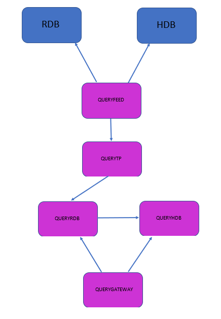

Functionality Overview
======================

Query Logging Management is an addition to TorQ to enhance the current query logging system. The aim for this tool is to have access to information about queries that are sent to specific processes throughout the day, allowing for query analysis to be carried. 

For each query executed we want access to:

- The time of the query
- The amount of time the query took to run
- Username of the person running the query
- IP address of the person running the query
- Host of the process that was being queried 
- Name of the process that was being queried 
- Process type of the process that was being queried 
- The query that was being executed including any parameters 

This query logging functionality can be enabled or disabled for specific processes using variables within TorQ config files.

Architecture
============

The architecture of the Query Logging Management framework is shown in the following diagram:

Processes
========

Query Feed
----------

If enabled within a TorQ process, the Query Feed process subscribes to updates from the .usage.usage table that is defined in the logusage.q handlers script from all enabled TorQ processes. 

Once a connection has been set up to our Query Tickerplant, the Query feed sends a message to execute the .u.upd function to inesrt this collected .usage.usage table into a usage table.

Query Tickerplant
-----------------

The Query Tickerplant process receives updates from the Query Feed process regarding the usage table and publishes it on to any subscribing process, operating the same way as a standard tickerplant. 

Query RDB
---------

The Query RDB works like a normal RDB process, receiving usage table messages from the Tickerplant and storing this in memory in order to be queried. At the end of day, the usage table is saved down onto disk to be loaded into the HDB. 

Query HDB
---------

The Query HDB loads in historical usage data from disk in order for long term query information to be queried.

Query Gateway
-------------

The Query Gateway process subscribes to our specific Query RDB and HDB processes to load balance queries and allow for access to query information involving both historical and real time data. The query gateway process also contains a number of analytics functions to return specific aggregations from the usage table (i.e how many queries were executed for each process on a specific day).

Table Contents
==============

The Query usage table contains the follow columns:

- time: The time that the query was received or when it finished executing 

- runtime: The time taken for the query to be executed

- zcmd: The .z function that was invoked 

- proctype: The process type of the process being queried 

- procname: The name of the process being queried

- status: Denotes whether the entry is before the query is executed (b), that the query has been successfully executed (c) or if the query execution was in error (e)

- ip: The IP address of the process being queried

- user: The user who is executing the query 

- handle: The handle over which the query is passed

- cmd: The query and its arguments as a string 

- mem: Memory information connected to the query execution

- sz: The byte size of the result from the query being executed

- error: An error string 

Setup 
=====

The TorQ Query Management logging tool can be added on top of any existing TorQ setup or the full TorQ application including Query logging can be integrated with data sources and feeds.

As mentioned above, there are 5 processes that need to be initialised: Query Tickerplant, Query RDB, Query Feed, Query HDB and a Query Gateway. An example of how these would be added to a process csv file is displayed below:

    localhost,{KDBBASEPORT}+24,querytp,querytp1,${TORQAPPHOME}/appconfig/passwords/accesslist.txt,1,0,,,${KDBCODE}/processes/segmentedtickerplant.q,1,-schemafile ${TORQAPPHOME}/querydatabase.q -tplogdir ${KDBTPLOG}
    localhost,{KDBBASEPORT}+25,queryrdb,queryrdb1,${TORQAPPHOME}/appconfig/passwords/accesslist.txt,1,1,60,4000,${KDBCODE}/processes/rdb.q,1,
    localhost,{KDBBASEPORT}+26,queryfeed,queryfeed1,${TORQAPPHOME}/appconfig/passwords/accesslist.txt,1,1,60,4000,${KDBCODE}/processes/queryfeed.q,1,
    localhost,{KDBBASEPORT}+27,queryhdb,queryhdb1,${TORQAPPHOME}/appconfig/passwords/accesslist.txt,1,1,60,4000,${KDBQUERYHDB},1,
    localhost,{KDBBASEPORT}+28,querygateway,querygateway1,${TORQAPPHOME}/appconfig/passwords/accesslist.txt,1,1,,4000,${KDBCODE}/processes/querygateway.q,1,

Each of these processes have their own unique process types and process files (except the Query RDB which uses the rdb.q file). Functionality for these 5 processes can be refined within each process config file. 

The Query Management logging tool is fully customisable so users can select specific processes that they want queries to be monitored for. To activate this functionality for a process, add the process name to the querytrack.csv file which is located in the TorQ/config/ directory. This csv file is loaded into the query feed process and used to activate Query Management Logging for each of the specified processes.
