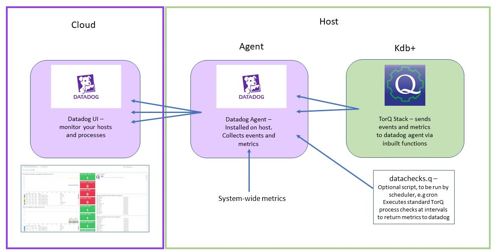
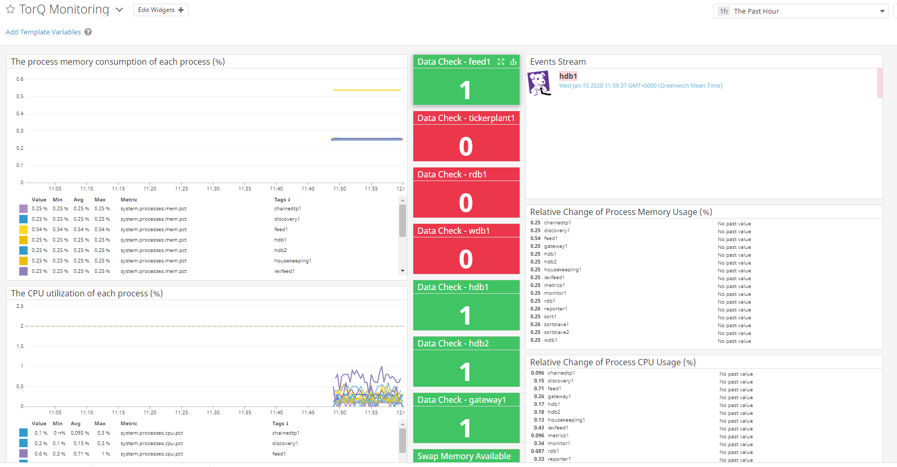

# Monitoring TorQ with Datadog

Datadog is a monitoring service for cloud-scale applications, providing
monitoring of servers, databases, tools, and services, through a SaaS-based data
analytics platform. This documentation provides a guideline on how to integrate TorQ and Datadog on
a Linux host.

<div style="width:640px; height:360px; margin: 0 auto;">
<iframe src="https://player.vimeo.com/video/378822571" width="640" height="360" frameborder="0" webkitallowfullscreen mozallowfullscreen allowfullscreen></iframe>
</div>

</br>  

## Architecture



The Datadog Agent is software that runs on your host, collecting events and
metrics from the host and sending them to Datadog, where you can analyze your
monitoring and performance data. We have provided the functionality to monitor
system metrics such as CPU and memory usage, report process errors to Datadog,
perform data checks and visualise the results on a custom dashboard.

Code is provided within TorQ to enable the integration of Datadog with a TorQ
stack on a unix host. At this time we do not
provide support for datadog integration on other operating systems. 

The directory layout of the relevant code is as shown below:

```
${TORQHOME}
|---datadog
    |---datachecks.q
    |---Example_TorQ_Monitoring_Dashboard.json
    |---monitors
    |---runchecks.sh
    |---setupdatadog.sh
```

```
${TORQHOME}
|---code
    |---common
        |---datadog.q
```

### Code Breakdown

* datadog/setupdatadog.sh

This script is provided for simple one step setup of datadog with default
options.

* datadog/runchecks.sh

Script provided for executing TorQ process checks on a scheduler, e.g crontab.
This script in turn calls datachecks.q, which queries TorQ processes and returns
a simple status (0b/1b) to datadog. The scheduling of a cron job to execute this
can be automatically done on setup using the setupdatadog.sh script (you will be
prompted as to whether you wish to set this up).

* datadog/Example_TorQ_Monitoring_Dashboard.json and datadog/monitors

These files provide an example dashboard and some simple monitors you can use to
start monitoring your host.

* code/common/datadog.q

This file provides the code and config you need to send metrics and events
directly from your TorQ processes to the datadog agent. 


## Installation

1. Install Datadog

There are multiple price plans available for Datadog, and a 14-day free trial is
also available - the monitoring provided here works with this free trial
version, however if you choose to convert to the free plan after the trial
expires then some functionality will be unavailable to you.  Sign up for datadog
[here](https://www.datadoghq.com/). Create your login details and select "next".

Supply Datadog with additional information, if necessary, and select "next".
Choose your operating system to get installation information for the datadog
agent (more information on the agent and getting started can be found
[here](https://docs.datadoghq.com/getting_started/agent/). 

When you've selected your OS, copy and paste the "easy one-step install" line into the terminal. This
will install the datadog agent on your host.

2. Run setup in TorQ to configure datadog

Once the agent is installed on your host, you can set up any required config to
enable you to use datadog with your TorQ stack. 

A Datadog directory has been added to TorQ that contains the relevant script
required to configure datadog:

* Configure which port the agent is listening on

By default, the Datadog agent will listen on port 8125 for any metrics/events
sent. If you want to change this port, change the value of DOGSTATSD_PORT in
your setenv.sh script

```
export DOGSTATSD_PORT=8125
```

and execute setenv.sh

```
. setenv.sh
```

You can then run the setup script provided, setupdatadog.sh

```
. setupdatadog.sh
```

This script will do a couple of things:

* Configure datadog.yaml and process.yaml files

These files are required for the agent to send metrics and events to datadog.
The datadog.yaml contains information about the port to listen on as well as
general configuration of the agent. (A default is generated when the agent is
installed, but we need to provide some configuration specific to our setup.)

The process.yaml file is a list of processes for which the agent reports
CPU/memory stats. By default these are all the processes present in the process.csv, but if required
a "datadog" column can be added to the process.csv and a value of 0/1 supplied
for each of the processes to indicate whether to add this process to the
process.yaml or not.

* Optionally schedule a cron job to run checks in each TorQ process.

On running setupdatadog.sh you will be prompted on whether you wish to schedule
a cron job. This job will run the runchecks.sh script, which in turn executes
the datachecks.q script, running a simple check, .dg.isok, in each TorQ process
and returning the response as a metric to datadog. If you don't want to schedule
these checks, or want to set them up yourself using a different scheduling tool, respond "n" when prompted.

Once this script has been executed, you can restart the datadog agent as
follows:

```
~$ sudo service datadog-agent restart
```

The agent is now receiving information on the stats of your processes, and if
you've enabled the cron job, your agent is also receiving the results of an example
TorQ process check, .dg.isok, at regular intervals.

## Utilities Provided

As well as the functionality to automate a series of process check using runchecks.sh and
datachecks.q, we have provided the functionality to send events and metrics to
datadog from within TorQ processes, using the functions within the .dg
namespace.

### TorQ Process Data Checks

We have provided an example of a process status check, .dg.isok:

```
q) .dg.isok

{$[.proc.proctype in key .dg.handlers;.dg.handlers .proc.proctype;1b]}

```

This simply returns a value of 1b, indicating that the process is running and
available to query. 

This can be sent as a metric to the datadog agent via the .dg.sendmetric
function, which takes a metric name as a string, and the result.

```
q) .dg.sendmetric["process_hdb1_check";1b]
```

Custom functions can be defined to perform other data quality checks, and the
results sent as a metric to the datadog agent. For example, checking the count
of records for a particular date in a table: 

```
.dg.checkcount:{[table;day] count select from table where date=day}
```

This can be sent to datadog in a similar way, returning a numerical value to be
visualised and monitored.

```
.dg.sendmetric["hdb1_trade_count";.dg.checkcount[trades;.z.d-1]]
```

Note, metrics are values sent from the system to quickly indicate the state of a
process or the system itself. The sendmetric function treats the metric as a
**gauge** metric (see [Datadog's
documentation](https://docs.datadoghq.com/developers/metrics/types/))
although other types are available, depending on the system you are monitoring
and what you are trying to measure. Gauge metrics are intended for quantitatively
measuring/tracking a variable, and as such expect a numerical value as a second
argument.

### Events and Errors

Events are sent in a similar way to Metrics, but indicate a noteworthy record of
activity - events can be configured into alerts on the Datadog UI by going to
"Monitors>add new>Event"

We can send an event from a TorQ process using the .dg.sendevent function:

```
.dg.sendevent[event_title;event_text;tags;alert_type]
```

This expects string arguments, and can accept any number of custom tags, and an
alert type one of "error", "warning" or "success". 

This also provides the functionality to send TorQ errors to datadog. TorQ
provides an extended logging hook which we can use to call the sendevent
function in addition to writing the error to a logfile.
This option can be enabled by changing the value of .dg.enabled to 1b (this is
set to 0b as a default in config/settings/default.q).


## Monitoring your stack using the Datadog UI

### Import an example dashboard

We have supplied an example dashboard which you can import into datadog - this
displays simple metrics such as process cpu %, process memory % and relative
changes in these, as well as TorQ-specific process checks and a stream of any
errors from TorQ processes.

The dashboard json is located at

`${TORQHOME}/datadog/Example_TorQ_Monitoring_Dashboard.json`

To import this into your datadog UI, go to the dashboards section
[here](https://app.datadoghq.com/dashboard/) And click **add new screenboard**.
In the settings section, select **import  dashboard json** and copy and paste
the json or browse your files to select the json dashboard you want to import.
You will be prompted with whether or  not you want to replace whatever is on the
screenboard - click yes.

Your dashboard will then load and display as below. The appearance of the
dashboard will depend whether you've enabled the extended error logging, and
whether you've scheduled a cron job to run data checks at regular intevals. 



A custom dashboard can be created to fit your systems needs. See the
documentation on dashboards [here](https://docs.datadoghq.com/dashboards/)

### Alerting

**Monitors** can be set up to track metrics and establish alerts based on
critical changes. We've provided some example monitors, designed to notify if a
process goes down, or system resources reach a limit. 

To import an example monitor, go to the "Monitors" section on your datadog
account, click **New Monitor**, then **Import Monitor*, and copy and paste the
JSON of the monitor you'd like to use into the text box provided, then click
save. The monitor will then become available and start alerting. 

You can create custom monitors using the guidelines in the Datadog documentation
[here](https://docs.datadoghq.com/monitors/monitor_types/)

## Monitoring Multiple Hosts

Depending on your datadog pricing plan, the option to monitor multiple hosts is
provided. To integrate Datadog and TorQ across all hosts, you will need to
install the agent on each host, and follow the installation instructions as
above. If your TorQ setup is operating across different hosts, you will need to
establish which processes to monitor on which host by configuring a "datadog"
column in the process.csv as discussed earlier.


