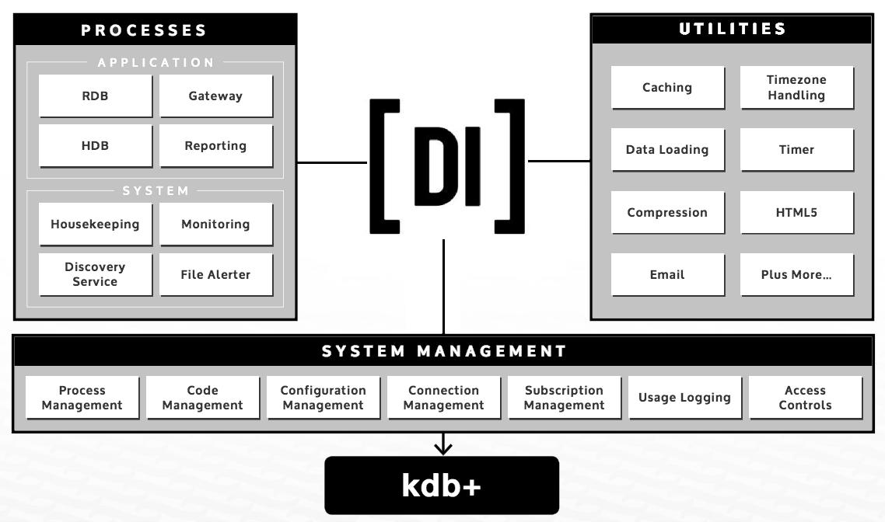

<iframe src="https://player.vimeo.com/video/184552498" width="640" height="360" frameborder="0" webkitallowfullscreen mozallowfullscreen allowfullscreen></iframe>

The TorQ framework created by [AquaQ Analytics](http://www.aquaq.co.uk) forms the basis of a production kdb+ system by implementing some core functionality and utilities on top of kdb+, allowing developers to concentrate on the application business logic. It incorporates as many best practices as possible, with particular focus on performance, process management, diagnostic information, maintainability and extensibility. Wherever possible, we have tried to avoid re-inventing the wheel and instead have used contributed code from [code.kx.com](http://code.kx.com) (either directly or modified). This framework will be suitable for those looking to create a new kdb+ system from scratch or those looking to add additional functionality to their existing kdb+ systems.

The easiest way to get a production capture started is to download and install one of the [Starter Packs](https://github.com/AquaQAnalytics/TorQ-Finance-Starter-Pack). We also have a [Google Group for questions/discussions](https://groups.google.com/forum/#!forum/kdbtorq).

For recent updates to TorQ please check out our [blog](http://www.aquaq.co.uk/blog/).

We've highlighted some key TorQ features on our blog posts page.

For email support contact <support@aquaq.co.uk>

