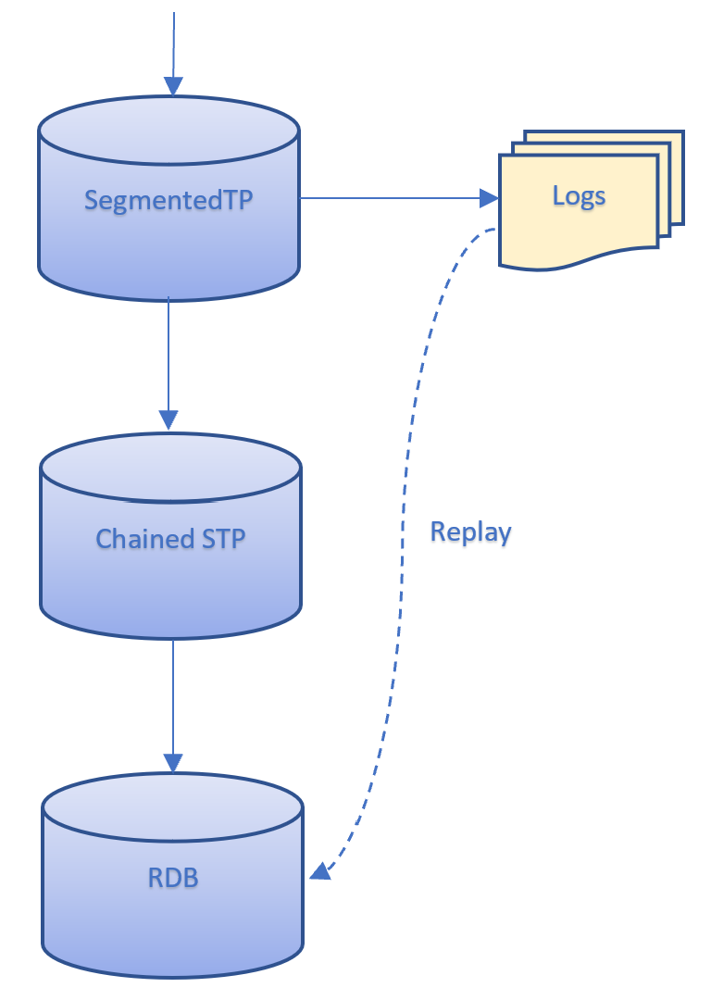

## Segmented Tickerplant Documentation

**Introduction**

A key component of the TorQ framework has always been the Tickerplant (TP) process. This process is a version with minor modifications of the process with the same name found in the kdb+ tick framework, which receives ticks from a feedhandler, timestamps them, and publishes them to any subscribed processes such as a real-time database (RDB) while writing the updates to a log file on disk. This process is perfectly functional, some use cases require greater flexibility. To this end, the Segmented Tickerplant (STP) has been developed.

**Segmented Tickerplant**

The idea behind the STP was to create a process which retained all the functionality of the Tickerplant while adding flexibility in terms of logging, publishing and subscriptions. The functionality of the STP is almost fully backwardly compatible with a few minor (and we believe seldom utilised) exceptions. We have introduced:

- ability to create more granular log files
- a new batch publication mode
- ability to easily introduce custom table modifications upon message receipt
- more flexible subscriptions
- error handling for easier debugging when developing data feeds
- performance improvements for several use cases
- faster restart

All the TorQ based subscriber processes (e.g. RDB and WDB), and any subscribers that use the TorQ subscription library, can switch between the TP and STP. For the minor modifications that must be made to data consumers, please see section XXXX.

What has been added are multiple logging modes, which allow the logs to be split and partitioned, and subscription modes, which alter how the data is batched and published, as well as error handling, which sends bad messages to a separate file and customisation options.

**Starting a Segmented Tickerplant process**

Starting an STP process is similar to starting a tickerplant, we need to have an updated process.csv that contains a line for the STP process like the one below. Optional flags such as `-.stplg.batchmode` and `-.stplg.errmode` can be added to change settings for the process.

```
localhost,${KDBBASEPORT}+103,segmentedtickerplant,stp1,${TORQAPPHOME}/appconfig/passwords/accesslist.txt,1,0,,,${KDBCODE}/processes/segmentedtickerplant.q,1,-schemafile ${TORQAPPHOME}/database.q -.stplg.batchmode immediate -.stplg.errmode 0 -t 1,q
```

The process can either be started using:

```shell
bash torq.sh start stp1
```

or:

```shell
q ${TORQHOME}/torq.q -proctype segmentedtickerplant -procname stp1 -load ${KDBCODE}/processes/segmentedtickerplant.q
```

**Logging Modes**

The default TP logging behaviour is to write all updates to disk in a single log file which is rolled on a daily basis. The log file may become large. A consumer of the data must replay all the data from the log file, even if only a subset is required. Additionally, when the TP restarts, it must count through the log file in full to ensure that it has the correct message number. 

To add more flexibility, the following logging modes have been added which are set with the `.stplg.multilog` variable. Additionally a table of meta data is stored to describe the log files, including the full schema of all the tables contained within it. The `.stpm.metatable` table is saved as a q object to the STPLOG folder along with any error logs generated by the error mode. ```

- none:

  This mode is essentially the default TP behaviour, where all ticks across all tables for a given day are stored in a single file, eg. `database20201026154808`. This is the simplest form of logging as everything is in one place.

Note that in this mode, and all other logging modes, a new log file will be created on STP restart, and the stpmeta table updated accordingly. Note also that in all modes the timestamp on the end of the log file (YYYYMMDDHHMMSS) will come from the system clock when the log file is created, and will not be rounded to any particular value.

  ```
  stplogs
      ├──stp1_2020.11.05/
      │  ├── err20201105000000
      │  ├── stpmeta
      │  └── stp1_20201105000000
      └──stp1_2020.11.06
         ├── err20201106000000
         ├── stpmeta
         └── stp1_20201106000000
  ```

- periodic:

  In this mode all the updates are stored in a the same file but the logs are rolled according to a custom period, set with `.stplg.multilogperiod`. For example, if the period is set to an hour a new log file will be created every hour and stored in a daily partitioned directory. As a result, this mode potentially allows for easier management by breaking the log files into smaller sizes, all while maintaining message arrival order during replays. Note that if the memory batch publish mode is used then the order is no longer guaranteed.

  ```
   stplogs
      ├──stp1_2020.11.05/
      │  ├── err20201105000000
      │  ├── periodic20201105000000
      │  ├── periodic20201105010000
      │  ├── periodic20201105020000
      │  └── stpmeta
      └──stp1_2020.11.06
         ├── err20201106000000
         ├── periodic20201106000000
         ├── periodic20201106010000
         ├── periodic20201106020000
         └── stpmeta
  ```

- tabular:

  This mode is similar to the default behaviour except that each table has its own log file which is rolled daily in the form `tradeYYYYMMDDHHMMSS`. This allows for more granular log file management, and prioritisation of data recovery.
  
  ```
   stplogs/
      ├── stp1_2020.11.05
      │   ├── err20201105000000
      │   ├── logmsg_20201105000000
      │   ├── packets_20201105000000
      │   ├── quote_20201105000000
      │   ├── quote_iex_20201105000000
      │   ├── stpmeta
      │   ├── trade_20201105000000
      │   └── trade_iex_20201105000000
      └── stp1_2020.11.06
          ├── err20201106000000
          ├── logmsg_20201106000000
          ├── packets_20201106000000
          ├── quote_20201106000000
          ├── quote_iex_20201106000000
          ├── stpmeta
          ├── trade_20201106000000
          └── trade_iex_20201106000000
  ```

- tabperiod:

  As the name suggests this mode combines the behaviour of the tabular and periodic logging modes, whereby each table has its own log file, each of which are rolled periodically as defined in the process. This adds the flexibility of both those modes when it comes to replays.
  
  ```
  stplogs/
      ├── stp1_2020.11.05
      │   ├── err20201105000000
      │   ├── err20201105010000
      │   ├── logmsg_20201105000000
      │   ├── logmsg_20201105010000
      │   ├── packets_20201105000000
      │   ├── packets_20201105010000
      │   ├── quote_20201105000000
      │   ├── quote_20201105010000
      │   ├── quote_iex_20201105000000
      │   ├── quote_iex_20201105010000
      │   ├── stpmeta
      │   ├── trade_20201105000000
      │   ├── trade_20201105010000
      │   ├── trade_iex_20201105000000
      │   └── trade_iex_20201105010000
      └── stp1_2020.11.06
          ├── err20201106000000
          ├── err20201106010000
          ├── logmsg_20201106000000
          ├── logmsg_20201106010000
          ├── packets_20201106000000
          ├── packets_20201106010000
          ├── quote_20201106000000
          ├── quote_20201106010000
          ├── quote_iex_20201106000000
          ├── quote_iex_20201106010000
          ├── stpmeta
          ├── trade_20201106000000
          ├── trade_20201106010000
          ├── trade_iex_20201106000000
          └── trade_iex_20201106010000
  ```

- custom

  This mode allows the user to have more granular control over how each table is logged. The variable `.stplg.customcsv` points to a CSV file containing two columns, table and mode, and this allows the user to decide which logging mode to use for each table. An example CSV is below:

  ```
  table,mode
  trade,periodic
  trade_iex,periodic
  quote,tabular
  quote_iex,tabluar
  heartbeat,tabperiod
  ```

  Here we have the trade and trade_iex tables both being saved to the same periodic log file, the quote and quote_iex tables both having their own daily log file and the heartbeat table having a periodic log file all to itself. This mode may be advantageous in the case where some tables receive far more updates than others, so they can have more rigorously partitioned logs, and the sparser tables can be pooled together. There is some complexity associated with this mode, as there can be different log files rolling at different times.

  As part of these new changes it is important to note that if the STP process is restarted, the stp will open new log files in the existing log directory and will not immediately replay the previous log files.

  Note that each of the new logging modes includes a q object saved in the directory called stpmeta, this is a table that contains information on the stp logs present in the directory. The table stpmeta contains multiple columns including:

- seq, the order of the logfiles, for periodic data all files for the same time period have the same seq number
- logname, pathway to the logfile
- start, the time and date that the logfile was created
- end, the time and date that the logfile was closed
- tbls, the tables present in each logfile
- msgcount, the count of the messages in each logfile
- schema, schemas for each of the tables in the tbls column
- additional, any additional information about the logfile

**Batching Modes**

There are named modes which are set with the `.stplg.batchmode` variable and these allow the user to be flexible with process latency and throughput by altering the `.u.upd` and `.z.ts` functions:

- defaultbatch:

  This is effectively the standard TP batching mode where, upon receiving a tick, the STP immediately logs it to disk and batches the update which is published to subscribers whenever the timer function is next called. This mode represents a good balance of latency and overall throughput.

- immediate:

  In this mode no batching occurs, and the update is logged and published immediately upon entering the STP. This is less efficient in terms of overall throughput but ensures low latency.

- memorybatch:

  In this mode, neither logging nor publishing happens immediately but everything is held in memory until the timer function is called, at which point the update is logged and published. High overall message throughput is possible with this mode, but there is a risk that some messages aren't logged in the case of STP failure. Also note that the the ordering of messages from different tables in the log file will not align with arrival order.

**Subscriptions**

Subscribing to the STP works in a very similar fashion to the original tickerplant. From the subscriber's perspective the subscription logic is backwardly compatible: it opens a handle to the STP and calls `.u.sub` with a list of tables to subscribe to as its first argument and either a null symbol or a list of symbols as a sym filter.  The STP also supports a keyed table of conditions (in q parse format) and a list of columns that should be published. 

Whilst complex bespoke subscription is possible in the STP it is generally not recommended. Complex subscription filtering should be off loaded to a chained STP.

```q
// Subscribe to everything
handletoSTP(`.u.sub;`;`)

// Subscribe GOOG and AAPL symbols in the trade table
handletoSTP(`.u.sub;`trade;`GOOG`AAPL)

// Subscribe to all tables but with custom conditions
handletoSTP(`.u.sub;`;conditions)
...
q) show conditions
tabname| filts     columns
-------| -----------------
trade  | sym=`GOOG
quote  | bid>50.0
```

The subscription logic is contained in the `pubsub.q` file. This file replaces much of the logic contained within `u.q` and utilises the `.stpps` namespace. When a process subscribes its handle is added to one of two dictionaries, `.stpps.subrequestall` or `.stpps.subrequestfiltered` depending on the subscription type. The logic which publishes updates to subscribers also sits in this file, and wherever possible the process will use a broadcast publish.

It is easy for a subscriber to subscribe to a STP process it follows the same process as subscribing to a TP through `.u.sub` however some changes have been made. Each subscriber connecting to the STP needs to be updated to search for a process of type segmentedtickerplant instead of tickerplant through changing `.servers.CONNECTIONS` in the settings config file for that process.

```
// For single connections e.g. $TORQHOME/appconfig/settings/rdb.q
.servers.CONNECTIONS:enlist `segmentedtickerplant

// For multiple connections e.g. $TORQHOME/appconfig/settings/wdb.q 
.servers.CONNECTIONS:`segmentedtickerplant`sort`gateway`rdb`hdb
```

The STP requires these functions to be defined in subscriber processes (the definitions will be unique to the requirements of each subscriber):
- upd[t;x]
  Called for updates from the STP. Arguments are t (the table the data is for), x (the data to be inserted) and now (the current time .z.p)
- endofperiod[currentpd;nextpd;data]
  Called at the end of a period for periodic STP modes. Takes 3 arguments currentpd (the current period), nextpd (the next period) and data (a dictionary containing some basic information on the stp process and the current time on the stp)
- endofday[date;data]
  Called at the end of day for all modes. Takes 2 arguments date (current date) and data (a dictionary containing some basic information on the stp process and the current time on the stp)

The data dictionary contains the STP name and type, list of subscribable tables in STP and the time at which the message is sent from the STP. In order to add further information to data, simply add additional elements in the endofdaydata function defined in code/segmentedtickerplant/stplg.q script.

**Error Trapping**

If the `.stplg.errmode` Boolean variable is set to true, an error log is opened on start up and the `.u.upd` function is wrapped in an error trap. If an error is thrown by the STP when it receives and update from the feed, then the update is written to the error log. This should allow easier debugging during onboarding of new data feeds. Unless the feed is very unstable, this should not be necessary in production usage as it incurs a small overhead on each update.

This mode is really designed for development/testing purposes, it shouldn't be necessary for a stable production feed and will add a small overhead to each update.

**Time Zone Behaviour**

A key tickerplant function is to timestamp the incoming data before it gets published to the rest of the system. Similar to the existing TP, the STP allows definition of 

- the timezone that data is timestamped at upon arrival
- the timezone that the STP executes it's end-of-day roll in 
- the offset from midnight that the STP executes its end-of-day roll in

This allows for more complex configurations, such as an Foreign Exchange data capture system which timestamps data in UTC but rolls at 5 PM EST. 

The key variable used is `.eodtime.dailyadj` but more information on setting up a TorQ process in a different time zone can be found [here](https://aquaqanalytics.github.io/TorQ/utilities/#eodtimeq).

**Per Table Customisation**

Each table has its own upd function, meaning that some additional processing, such as adding a sequence number or a time-zone offset, can be done in the STP itself rather than needing to be done in a separate process. This is done by altering the `.stplg.updtab` dictionary in the segmentedtickerplant settings config file. The default behaviour is for every update to automatically have the current timestamp applied to it.

```q
// In file $TORQHOME/appconfig/settings/segmentedtickerplant.q
// Apply a sequence number to 'tabname'
.stplg.updtab[`tabname]:{((count first x)#'(y;.stplg.seqnum),x}

// In the STP process
q) .stplg.updtab
quote   | {(enlist(count first x)#y),x}
trade   | {(enlist(count first x)#y),x}
tabname | {((count first x)#'(y;.stplg.seqnum),x}
...
```

The batching behaviour depends on two functions: `.u.upd` and `.z.ts`. The former is called every time an update arrives in the STP and the latter whenever the timer function is called (e.g. if the process is started with `-t 1000`, this will be called every second). In the default batching mode, `.u.upd` inserts the update into a local table and writes it to the log file, and `.z.ts` publishes the contents of the local table before clearing it. To customise these functions, the `.stplg.upd` and `.stplg.zts` dictionaries will need to be customised. For example, the default batching code looks like the following:

```q
\d .stplg

// Standard batch mode - write to disk immediately, publish in batches
upd[`defaultbatch]:{[t;x;now]
  t insert x:.stplg.updtab[t] . (x;now);
  `..loghandles[t] enlist(`upd;t;x);
  // track tmp counts, and add these after publish
  @[`.stplg.tmpmsgcount;t;+;1];
  @[`.stplg.tmprowcount;t;+;count first x];
 };

zts[`defaultbatch]:{
  // publish and clear all tables, increment counts
  .stpps.pubclear[.stpps.t];
  // after data has been published, updated the counts
  .stplg.msgcount+:.stplg.tmpmsgcount;
  .stplg.rowcount+:.stplg.tmprowcount;
  // reset temp counts
  .stplg.tmpmsgcount:.stplg.tmprowcount:()!();
 };

\d .
```

Once this is done, simply update `.stplg.batchmode` with the name of the new mode and start the process.

**Performance Comparison**

A custom performance stack was set up comprising a feed, a consumer, an STP, a vanilla TP (normal TorQ tickerplant) and a kdb+ tick process along with an observer process which was responsible for coordinating the tests and processing the results. When the tests begin, the feed pushes single row updates to the selected TP process in a loop for one minute before pushing updates in batches of 100 rows for one minute. The observer then collects the results from the consumer which is subscribed to the TP and clears the table before resetting things so that the feed is pointing at either the same process in a different batching mode or a new process. In this way all the process modes are tested, including the immediate and batched modes for the TP and tick processes.

These tests were run on a shared host with dual Intel Xeon Gold 6128 CPUs with a total of 12 cores and 24 threads with 128GB of memory. The results below show the median and average number of messages per second (mps) received by the subscriber. The results for single updates can be seen below. It should be noted that the message rates achieved will be dependent on hardware configuration. The purpose of the testing below is to demonstrate the relative performance between the different implementations and batching modes.

| Process | Batch Mode    | Median mps | Average mps |
| ------- | ------------- | :--------: | :---------: |
| STP     | Default batch |    103k    |    103k     |
| STP     | Immediate     |    93k     |     89k     |
| STP     | Memory batch  |    181k    |    174k     |
| TorQ TP | Immediate     |    80k     |     75k     |
| TorQ TP | Batch         |    110k    |     98k     |
| Tick    | Immediate     |    87k     |     87k     |
| Tick    | Batch         |    109k    |    103k     |

And the following are for batched updates (note that each message contains 100 ticks):

| Process | Batching Mode | Median mps | Average mps |
| ------- | ------------- | :--------: | :---------: |
| STP     | Default batch |    20k     |     19k     |
| STP     | Immediate     |    19k     |     18k     |
| STP     | Memory batch  |    21k     |     21k     |
| TorQ TP | Immediate     |    19k     |     18k     |
| TorQ TP | Batch         |    19k     |     18k     |
| Tick    | Immediate     |    20k     |     17k     |
| Tick    | Batch         |    20k     |     19k     |

The first obvious thing to be noticed is that batching the updates results in greater performance as there are fewer IPC operations and disk writes, and while some insight can be gleaned from these figures the single update results provide a better comparison of the actual process code performance. The memory batching mode is the clear leader in terms of raw performance as it does not write to disk on every update. The three 'default' batching modes are roughly equivalent in terms of performance and all have similar functionality. The three Immediate modes bring up the rear in terms of raw throughput, though the STP version is the performance leader here as it stores table column names in a dictionary which can be easily accessed rather than having to read the columns of a table in the root namespace.

In this set up each message contained either one or 100 ticks, each of which had 11 fields, and there was one feed pushing to one TP which had one simple subscriber and varying these figures will impact performance. Increasing the fields in each tick or the number of ticks in a message will results in more costly IPC and IO operations which will decrease performance. Having more subscribers and increasing the complexity of subscriptions, ie. having complex where clause conditions on the subscription, will also reduce performance. These are all things worth bearing in mind as one builds an application.

When writing the code for these STP modes some compromise was taken between performance and maintenance. All the UPD functions are written in a standard way and have certain common elements abstracted away in namespaces, which does technically reduce performance. Also the effort made to ensure backwards compatibility means that certain left-field options were not taken advantage of, for example, sending enlisted lists from the Immediate mode rather than converting them to tables first. We will see later on how custom modes can be defined which can be more tailored to a given application.

**Chained STP**

A chained tickerplant (CTP) is a TP that is subscribed to another TP. This is useful for the following:

- protecting the main TP by offloading publication load. Examples would be distributing data to multiple consumers, or executing complex subscription filtering logic.
- distributing a system across multiple hosts where data is pushed once across a host boundary and then further distributed within that host. The CTP can also be used to create a local version of the TP log files within that host.

With these new changes to the tickerplant, we have added new features to chained tickerplants as well. Under a typical tick system there is one TP log for the main TP for each day, if a CTP goes down or needs to replay data the replay must happen from the main TP. A chained STP can have it's own log file and be in a different batching mode than the main TP, e.g. top level has no batching and chained STP has memory batching, to allow greater flexability.

- None: Chained STP does not create or access any log files.
- Create: Chained STP creates its own log files independent of the STP logs. Subscribers then access the chained STP log files during replays
- Parent: STP logs are passed to subscribers during replays. Chained STP does not create any logs itself 

The 'parent' logging mode is useful when all of the Torq processes have access to the same disk. In this case, the subscriber can access the logs of the STP and the data is replayed through the Chained STP. This prevents the SCTP from needing to create duplicate logs and so saves on storage. This replay would look like the following:



The 'create' logging mode should be used when the chained STP is running on a separate host to the STP, as illustrated in the diagram below. Here RDB1 may access the STP logs as they are running on the same host. However, RDB2 does not have access to the STP logs and so they cannot be replayed through the SCTP. Therefore, the chained STP needs to create its own logs for RDB2 to access.


**Backward Compatibility**

Not everything about the STP is exactly the same as the TP, a couple of things have been changed:

- All updates must be lists of lists, meaning that single updates must be enlisted.
- Consumers must have endofday[currentdate;DATA], endofperiod[currentperiod;nextperiod;DATA] and upd[newdata;table] defined in order to successfully subscribe to the STP (.u.end is no longer used). Here DATA is a dictionary of metadata about the STP containing the STP name and type, subscribable tables and the time at which the message was sent from the STP.
- First two columns in tables do not have to be time and sym 
